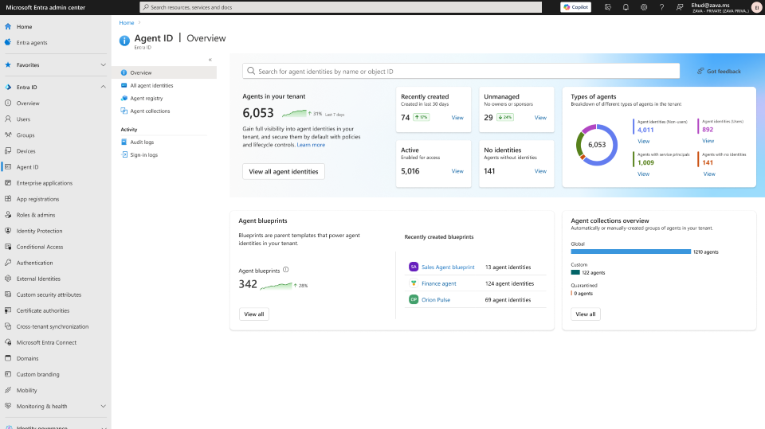
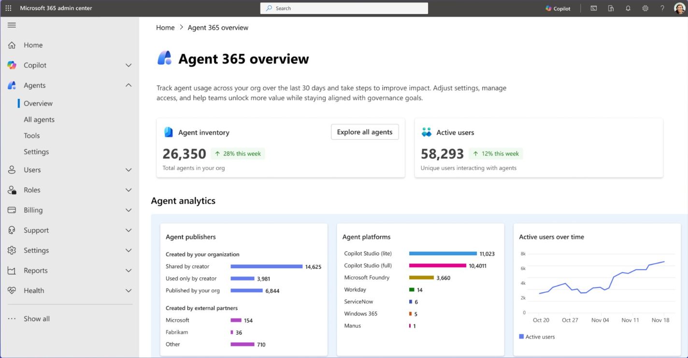
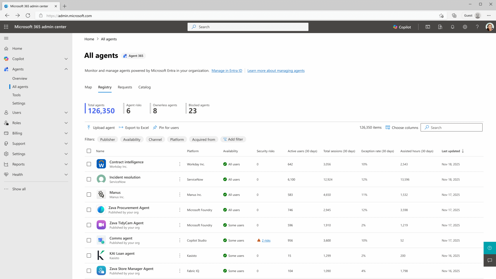
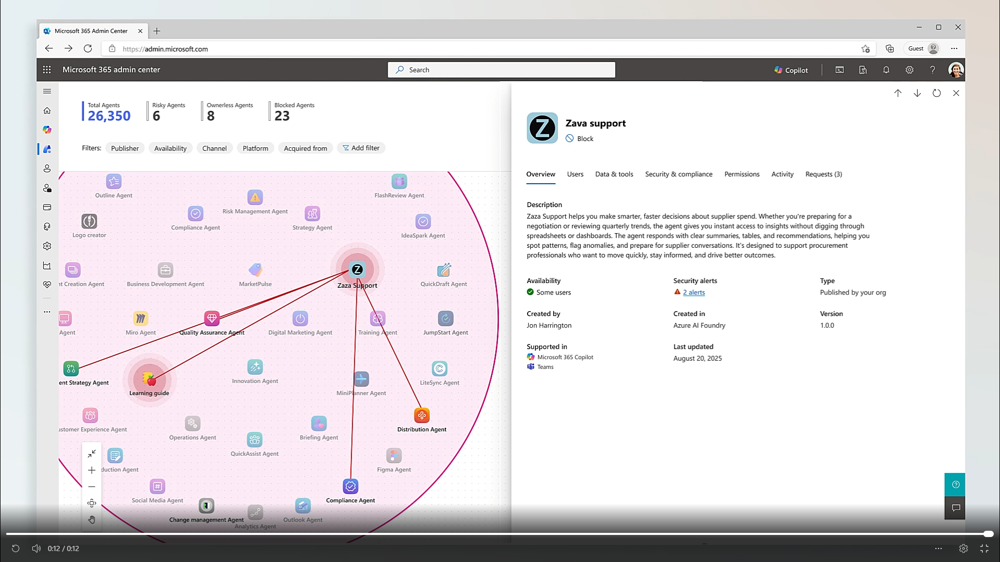

<!-- _class: lead -->


# Ignite 注目ポイント

## 全体サマリー & AIエージェント編

**胡田 昌彦**（日本ビジネスシステムズ株式会社 / Microsoft MVP）

HCCJP 第68回勉強会
2025年12月12日

---

<!-- _class: small -->

# 自己紹介

### 胡田 昌彦（えびすだ まさひこ）

- **所属**: 日本ビジネスシステムズ株式会社（JBS）
- **Microsoft MVP（2014年〜）**: Azure Hybrid / Windows Server

### 活動

- https://ebisuda.net/
- https://youtube.com/@ebibibi
㊗️チャンネル登録者数1万人


---

<!-- _class: small -->

# 本資料について

### 免責事項

- 本資料は **Microsoft Ignite 2025** の公式情報および関連資料をもとに、
  発表者（胡田）が **AI とディスカッションしながら解釈・整理** したものです
- 内容の **正確性は保証しません**
- 正式な情報は Microsoft 公式ドキュメントをご確認ください
- 製品名・機能名・提供時期等は変更される可能性があります

### 参考にした主な情報源

- Microsoft Ignite 2025 セッション動画・スライド
- Microsoft Learn / Tech Community ブログ
- 各製品の公式ドキュメント

---

<!-- _class: small -->

# アジェンダ

Microsoft Ignite 2025 の注目ポイント

1. **Ignite 2025 全体の傾向**
   - 「Frontier Firm」という世界観
   - エージェントの無秩序な増加とガバナンス
2. **AIエージェントの最新動向**
   - Entra Agent ID / Agent 365
   - 3つの「IQ」と Agent Factory
   - Microsoft Foundry / MCP / A2A
3. **実装とアーキテクチャ**
   - プラットフォーム比較
   - 推奨アーキテクチャ

⏱️ 約30分

---

<!-- _class: lead -->

# Frontier Firm とは？

## Microsoft が目指す「AI先進企業」の姿

---

<!-- _class: small -->

# Frontier Firm の特徴

### Frontier Firm = AI を"点"ではなく"面"で使う企業

- **複数の業務領域**で AI / エージェントを活用
  - 人間が主導し、エージェントがオペレーションを行う
  - 営業 / サポート / 開発 / 経理 / HR … 平均 7 つ以上の業務領域
- **既製の Copilot だけでなく**
  - 自社専用のカスタムエージェントを構築・運用
  - エージェントによって業務プロセスそのものを再発明する
- ビジネス成果
  - AI活用が遅れている企業と比べて **数倍の生産性・ROI**

### Ignite 2025 のメッセージ

> **「すべての企業を Frontier Firm に近づけるためのプラットフォームを揃えた」**
> そのキーコンセプトが
> **エージェント** / **3つのIQ** / **Agent Factory**。Copilotがすべての窓口。

---

<!-- _class: x-small -->

# エージェントが無秩序に増加する現実

## なぜ今「エージェント管理」が急務なのか？

### 現場で起きていること

- 部門ごとにバラバラに
  - SaaSの中に埋め込まれたエージェント
  - 個人が立ち上げたチャットボット
  - 外注ベンダーが作ったカスタムエージェント
- 結果として…
  - **誰が作った？**
  - **何にアクセスできる？**
  - **どこで動いている？**
  - を把握できない "エージェントの野良化" が発生

### Microsoft の回答

> 人間と同じように
> **「エージェントにもIDを付けて、統合的に管理する」**

→ Entra Agent ID / Agent 365 の登場

---

<!-- _class: lead -->

# AIエージェント時代の到来

## 人間と同じように AI エージェントを管理する

---

<!-- _class: small -->

# なぜAIエージェントにIDが必要なのか？

## これまでのMicrosoftのID管理の考え方

### 一貫した方針：すべてのアクセス主体にIDを

- **人間（ユーザー）**: Entra IDでID管理
- **アプリケーション**: サービスプリンシパル / マネージドID
- **デバイス**: デバイスID / Intune管理
- **そしてAIエージェント**: **Microsoft Entra Agent ID** 🆕

### Zero Trustの原則

> 「誰が」「何を」「どこから」アクセスしているか常に検証

- トークンを持っているだけでは信頼しない
- コンテキスト（ID・デバイス・場所・リスク）で毎回検証
- **AIエージェントも例外ではない**

---

<!-- _class: x-small -->

# Microsoft Entra Agent ID

## AIエージェントを「一級市民」として管理

### 主要な機能

- **エージェントの発見と登録**
  - シャドーエージェントを含む、すべてのAIエージェントを発見(coming soon)
  - 一意のIDを割り当て、完全なインベントリを維持

- **Agent Registry（エージェントレジストリ）**
  - 組織内のすべてのAIエージェントの「唯一の情報源」
  - 作成者、実行場所、機能、ガバナンスポリシーを管理

- **ライフサイクル管理**
  - 作成・更新・無効化を自動化
  - Entra ID Governance のアクセスパッケージと連携し
    意図的・監査可能・期限付きのアクセスを実現

- **リソースアクセス保護**
  - Identity Protection、条件付きアクセス、ネットワーク制御と統合
  - 危険なエージェント・悪性サイト・危険なアップロード/ダウンロードをブロック

> **ポイント**: Copilot Studio だけでなく、**非Microsoftエコシステム**のエージェントも管理対象にする思想

---


<!-- _class: small-->

# Agent ID ダッシュボード



<small>

出典: [Microsoft Entra: What's New in Secure Access on the AI Frontier https://techcommunity.microsoft.com/blog/microsoft-entra-blog/microsoft-entra-what%E2%80%99s-new-in-secure-access-on-the-ai-frontier/4468732](https://techcommunity.microsoft.com/blog/microsoft-entra-blog/microsoft-entra-what%E2%80%99s-new-in-secure-access-on-the-ai-frontier/4468732)

</small>

---

<!-- _class: x-small -->

# Microsoft Agent 365

## 既存サービスを「エージェント軸」で統合管理するコントロールプレーン

### 実態：新製品ではなく「統合レイヤー」

| 機能 | 実体（既存サービス） |
|------|---------------------|
| **Registry** | Entra Agent ID / Agent Registry |
| **Access Control** | Entra 条件付きアクセス |
| **Security** | Defender / Purview DLP |
| **Visualization** | M365管理センターの新ダッシュボード |
| **Interoperability** | Copilot Studio / Foundry連携 |

### 何が新しいのか

- **UI/UX**: M365管理センターに「エージェント専用ビュー」が追加
- **統合シグナル**: 各製品のシグナルを「エージェント単位」で集約
- **ポリシーの一元適用**: バラバラだった設定を1箇所で管理

> **つまり**: Defender + Entra + Purview + M365を
> **「エージェント軸で見るレンズ」** として提供

---

<!-- _class: small -->

# Agent 365 ダッシュボード



<small>

出典: [Microsoft Agent 365: The control plane for AI agents | https://www.microsoft.com/en-us/microsoft-365/blog/2025/11/18/microsoft-agent-365-the-control-plane-for-ai-agents/](https://www.microsoft.com/en-us/microsoft-365/blog/2025/11/18/microsoft-agent-365-the-control-plane-for-ai-agents/)

</small>

---

<!-- _class: small -->

# Agent 365 エージェント一覧



<small>

出典: [Microsoft Agent 365: The control plane for AI agents | https://www.microsoft.com/en-us/microsoft-365/blog/2025/11/18/microsoft-agent-365-the-control-plane-for-ai-agents/](https://www.microsoft.com/en-us/microsoft-365/blog/2025/11/18/microsoft-agent-365-the-control-plane-for-ai-agents/)

</small>

---

<!-- _class: small -->

# Agent 365：エージェントの可視化



<small>

出典: [Microsoft Agent 365: The control plane for AI agents | https://www.microsoft.com/en-us/microsoft-365/blog/2025/11/18/microsoft-agent-365-the-control-plane-for-ai-agents/](https://www.microsoft.com/en-us/microsoft-365/blog/2025/11/18/microsoft-agent-365-the-control-plane-for-ai-agents/)


</small>

---

# エージェントをどう管理するか？
 エージェントは「作って終わり」ではなく、
 **作った後の"運用・監視・防御"まで含めて設計する時代**

 - クラウド上で動くエージェントも
 - オンプレミスで動くエージェントも

---

<!-- _class: lead -->

# 3つの「IQ」

## AIエージェントを支えるインテリジェンス層

---

<!-- _class: small -->

# RAGの本質を理解する

## 「ベクトル検索」だけがRAGではない

### よくある誤解

> RAG ＝ ベクトルストアにドキュメントを突っ込んで検索してプロンプトに貼り付ける

### 本質

> RAG ＝ **事前に構築したデータ構造から、必要な情報を取得してプロンプトを組み立てる**

### 「データ構造」は何でもよい

- ベクトルDB（埋め込み検索）
- グラフDB（関係性の検索）
- RDB / SQL（構造化データ）
- API呼び出し（リアルタイムデータ）
- ファイルシステム / SharePoint / Graph …

**→ これが「コンテキストエンジニアリング」の考え方**

---

<!-- _class: small -->

# コンテキストエンジニアリングと3つのIQ

## 3つのIQは「領域別コンテキストエンジニアリング」

```text
┌─────────────────────────────────────────────────────────────┐
│             コンテキストエンジニアリング                      │
│  「事前に作ったデータ構造から必要な情報を取得して            │
│    プロンプトを組み立てる」                                   │
└─────────────────────────────────────────────────────────────┘
                              │
        ┌─────────────────────┼─────────────────────┐
        ↓                     ↓                     ↓
┌───────────────┐   ┌───────────────┐   ┌───────────────┐
│   Work IQ     │   │  Fabric IQ    │   │  Foundry IQ   │
│ ────────────  │   │ ────────────  │   │ ────────────  │
│ M365 / Graph  │   │ Fabric / BI   │   │ AI Search     │
│ 人と仕事の文脈│   │ データの意味  │   │ 企業ナレッジ  │
└───────────────┘   └───────────────┘   └───────────────┘
```

**→ 3つのIQは、それぞれの領域に最適化された「コンテキスト取得基盤」**

---

# 3つのIQ 概要

## 領域ごとに最適化されたインテリジェンス層

| IQ | 対象領域 | 関連サービス | 一言で言うと |
|----|----------|-------------|-------------|
| **Work IQ** | 人と組織の仕事 | Microsoft 365 Copilot / Graph | 「あなたと会社の"仕事の文脈"を理解する |
| **Fabric IQ** | ビジネスデータ | Microsoft Fabric / OneLake / Power BI | 「会社のデータ」を意味づける |
| **Foundry IQ** | エージェント向け企業ナレッジ | Azure AI Foundry / AI Search | 「企業の知識ベース」を統合し、エージェントに届ける |

### ポイント

- 3つとも大雑把に言えば **広義のRAG（コンテキストエンジニアリング層）** だが、対象データと最適化が異なる
- それぞれが **既存サービスの上に構築** されている
- エージェントは用途に応じて **複数のIQを組み合わせて** 利用可能

---

<!-- _class: x-small -->

# Work IQ

## Microsoft 365 Copilot の頭脳

### あなたの仕事を理解する

- **データ**
  - メール、ファイル、会議、チャットなど
    組織・個人データに広く接続
- **メモリ**
  - 好み、頻出タスク、コラボ相手など
    あなたの仕事のコンテキストを学習・記憶
- **推論**
  - 洞察を提供し、ニーズを予測し、タスクを先回りして実行

### 新機能

- **会話メモリ**
  - セッションをまたいでコンテキストを保持
- **SharePoint メタデータ推論（GA）**
  - ドキュメント内容からメタデータを自動推論し、
    構造化された回答精度を向上

> Work IQ 上で動く 3つの新エージェント:
> **Workforce Insights / People / Learning Agent**

---

<!-- _class: small -->

# Fabric IQ

## ビジネスデータのインテリジェンス層

### Microsoft Fabric と統合（プレビュー）

- Power BI の **統一セマンティックレイヤー** を
  ビジネス運用レイヤーに拡張
- **2,000万以上のセマンティックモデル**を対象に

### 何ができる？

- 分析データ・時系列データ・位置データ などを統合
- BIモデルに埋め込まれた「ビジネス意味」を、
  運用システムからもそのまま活用
- **リアルタイム**で人間とAIが行動可能な「ライブビュー」を提供

> データ分析・ガバナンス・インサイトのためのインテリジェンス層

---

<!-- _class: small -->

# Foundry IQ

## 従来のRAGから次世代RAGへ

| | 従来のRAG | Foundry IQ（次世代RAG） |
|------|----------|----------------------|
| **検索** | キーワード / ベクトル検索 | コンテキストエンジニアリング |
| **グラウンディング** | 単純な文書参照 | 意味理解に基づく根拠付け |
| **精度** | ハルシネーションが課題 | ハルシネーションを**大幅に削減することを目指す** |
| **基盤** | 個別実装 | Azure AI Search に統合された基盤 |

### Foundry IQ の位置づけ

- **RAG の進化形**として、より正確で信頼性の高い応答を目指す
- カスタムAIエージェント構築のための
  開発者向けインテリジェンスレイヤー
- Azure AI Search に依存しない既存システムからも
  段階的に移行できるアーキテクチャを想定

> 現在プレビュー提供中

---

<!-- _class: small -->

# 3つのIQの関係

## Microsoft Agent Factory

| IQ | 対象 | 役割 |
|------|------|------|
| **Work IQ** | エンドユーザー | 仕事・組織・個人を理解 |
| **Fabric IQ** | ビジネスデータ | データ統合・分析・ガバナンス |
| **Foundry IQ** | 開発者 | エージェント構築・RAG強化 |

### Agent Factory

- 3つのIQを統合した **エージェント構築プログラム**
- **単一の従量課金プラン**で
  Microsoft Foundry / Copilot Studio を利用可能
- 初期ライセンス・大規模プロビジョニング不要で
  小さく作って従量課金で回す PoC がしやすい
- Frontier Firm を目指すための
  **「エージェント工場」的な位置づけ**

---

<!-- _class: x-small -->

# Microsoft Foundry 概要

## Microsoft Foundry とは？

- 旧 **Azure AI Foundry** の機能を拡張した
  **エージェント開発の統合PaaS**
- 特徴
  - **11,000+ のモデル**にアクセス
    - OpenAI / Anthropic / xAI / Meta / Mistral / Cohere / Microsoft Research … など
  - LLMだけでなく、ツール・ワークフロー・データ接続まで統合管理
  - Enterprise 向けの監査 / RBAC / ネットワーク制御を提供

## Foundry Agent Service / Foundry Tools

- **Foundry Agent Service**
  - マルチエージェントのオーケストレーション
  - カスタムエージェントのデプロイ・スケーリング
- **Foundry Tools**
  - 1,000+ の標準ツールカタログ＋社内専用ツール
  - Entra Agent ID と連携した安全なツール実行

> 「モデル単体」ではなく
> **エージェント全体のライフサイクルを面倒見るプラットフォーム**

---

<!-- _class: x-small -->

# MCP / A2A と相互運用性

## 「Microsoft の世界に閉じこめない」ための標準化

### MCP (Model Context Protocol)

- Anthropic などが提唱する **オープンなプロトコル**
- エージェントとツール／システムをつなぐ共通言語
- Microsoft Foundry / Copilot Studio / Teams エージェント が
  MCP ツールカタログをサポート

### Agent-to-Agent (A2A) プロトコル

- 異なるクラウド／ランタイム上のエージェント同士を連携
- Microsoft Agent Framework / Foundry Agent Service でも対応
- 将来的に **「エージェント間のマイクロサービス」** のような世界を想定

### メッセージ

> Microsoft のエコシステムに「閉じ込める」のではなく、
> 標準プロトコルで **外の世界ともつながる前提** で設計されている。

---

<!-- _class: lead -->

# AI開発プラットフォームの選択肢

## どこでエージェントを構築・実行するか？

---

<!-- _class: x-small -->

# AI開発プラットフォームの比較

| 観点 | Microsoft 365 Copilot | Copilot Studio | Microsoft Foundry（旧 Azure AI Foundry） | Azure上でのモデル直叩き開発 | 非Microsoft |
|------|---------------------|----------------|----------------------------------------|--------------------------|-------------|
| **対象者** | エンドユーザー | ビジネスユーザー | 開発者 / DS / プラットフォームチーム | 開発者 | 開発者 |
| **開発手法** | 利用のみ（エンドユーザー視点） | ローコード | コードファースト | フルコード | フルコード |
| **M365統合** | ネイティブ | シームレス | API / コネクタ経由 | 原則なし | なし |
| **ガバナンス** | M365 標準ポリシー | Power Platform (DLP / 監査) | Azure RBAC / Foundry 管理機能 | Azure RBAC など | 自前構築 |
| **モデル選択** | 固定 | 限定的 | 11,000+ | 11,000+ から必要なものを選択 | 任意 |
| **カスタマイズ** | 低（Copilot 構成レベル） | 中（ワークフロー／プラグイン） | 高（コード＋ツール＋データ） | 最高 | 最高 |
| **立ち上げ速度** | 即時 | 数日 | 数週間 | 数週間〜 | 数ヶ月〜 |
| **運用負荷** | 最小 | 小 | 中〜大 | 大 | 最大 |

---

<!-- _class: x-small -->

# 各プラットフォームの位置づけ（1/2）

## SaaS / PaaS 層

### Microsoft 365 Copilot（SaaS）

- すぐ使える完成品
- エンドユーザー視点では **「利用のみ」**
- カスタマイズは Copilot Studio 経由で実施

### Copilot Studio（ローコードPaaS）

- ビジネスユーザー向け
- M365 / Power Platform との統合が強み
- ガバナンス（DLP、監査ログ、コンプライアンス）が組み込み

### Microsoft Foundry（コードファーストPaaS）

- 開発者・プラットフォームチーム向け
- 11,000+ モデル ＋ Tools ＋ エージェント管理
- Agent Factory と組み合わせて Frontier Firm を目指す層

---

<!-- _class: x-small -->

# 各プラットフォームの位置づけ（2/2）

## IaaS / 自前構築 層

### Azure上でのモデル直叩き開発（IaaS的）

- AKS / VM / Functions などでモデルだけを利用
- Microsoft エコシステムをあまり使わず、フルスクラッチで作りたい場合

### 完全非Microsoft（オンプレ / 他クラウド / OSS）

- 例: 自前の Kubernetes クラスタ＋OSS LLM＋自作オーケストレーション
- 最大の自由度と引き換えに、ガバナンス・セキュリティもすべて自前設計

### 選択の指針

| 優先事項 | 推奨 |
|---------|------|
| すぐ使いたい / M365中心 | Copilot + Copilot Studio |
| カスタムモデル / 高度な制御 | Microsoft Foundry |
| 完全な自由度 | Azure IaaS or 非Microsoft |

---

<!-- _class: x-small -->

# 推奨アーキテクチャ

## フロントエンド / バックエンド パターン

```text
┌─────────────────────────────────────────────────────┐
│  ユーザー（Teams / Web / Mobile）                    │
└─────────────────────┬───────────────────────────────┘
                      ↓
┌─────────────────────────────────────────────────────┐
│  Copilot Studio（フロントエンド）                    │
│  - 会話UI、ユーザー対応、簡易ロジック                │
└─────────────────────┬───────────────────────────────┘
                      ↓ 複雑なタスクをルーティング
┌─────────────────────────────────────────────────────┐
│  Microsoft Foundry（バックエンド）                   │
│  - 高度な推論、カスタムモデル、マルチエージェント    │
│  - Foundry IQ / Foundry Tools / MCP ツール           │
└─────────────────────────────────────────────────────┘
```

### ベストプラクティス

- 多くの組織は Copilot Studio と Microsoft Foundry を併用
- Copilot Studio でプロトタイプ → Foundry で本番構築
- その上に Entra Agent ID / Agent 365 / Security Copilot をかぶせて
  ガバナンスとセキュリティを担保

---

<!-- _class: x-small -->

# Q&A：Entra Agent ID とサービスプリンシパル

### Q1. 今までもアプリケーションにはサービスプリンシパルがありました。AIエージェント用のIDとして使うのが「当たり前」だったと思うのですが、Entra Agent IDは本質的に何が違うの？

**A1. ざっくり言うと、「AIエージェント専用に設計されたサービスプリンシパル＋ガバナンス基盤」です。**

| | サービスプリンシパル | Entra Agent ID |
|------|---------------------|----------------|
| **想定** | 長期間動くアプリ／サービス前提 | 大量＆短命なエージェント前提 |
| **スケール** | オブジェクト数は少なめ | Copilot/Foundry/外部由来の大量エージェント |
| **管理** | 汎用的なアプリ管理 | Agent Registryと連動し専用スキーマで管理 |
| **ガバナンス** | 個別に設定 | 条件付きアクセス、Identity Protection、アクセスパッケージなどと「エージェント単位」で統合 |

> **結論**: 「エージェントっぽいSPを頑張って運用する」のではなく、最初からエージェント専用レーンを用意したのがEntra Agent ID。

---

<!-- _class: x-small -->

# Q&A：外部エージェント & 野良AIはどう見える？

### Q2. Microsoftのプラットフォーム以外で動いているエージェントも、そのままAgent 365に取り込めますか？

**A2. いいえ。何も変えず"完全にそのまま"取り込むことはできません。**

**「この世界観に正式参加」するには：**
- Microsoft Foundry / Copilot Studio上でエージェントを作る、または
- Microsoft Agent Identity Platform（＋MCP/A2Aなど）を使ってEntraにAgent IDを登録し、EntraをIdPにして動かす

**完全に独立していてEntraと一切しゃべらないエージェントは：**
- Agent Registryに"記録として"載せることはできても
- IDレベルでフルにガバナンスを効かせる対象にはならない

---

<!-- _class: xx-small -->

# Q&A：野良OpenAI呼び出しの検知・ブロック

### Q3. OpenAIのSDKでapi.openai.comを叩いているだけの「野良エージェント」が社内にあった場合、Agent 365で検知したりブロックしたりできますか？

**A3. 検知・ブロック自体は「もともとの機能」でできます。ただしAgent 365の新機能ではなく：**

| 製品 | 役割 |
|------|------|
| **Defender for Cloud Apps** | Cloud Discovery |
| **Defender for Endpoint** | ネットワーク保護 |
| **Entra Internet Access** | SSE / SWG |

これらのFW／Proxy／エンドポイントレベルの制御機能で：
- api.openai.comへの通信を検知
- 「AIアプリカテゴリ」を禁止
- ドメイン単位でブロック …といった制御が可能

### 役割分担の整理

| 対象 | 担当 |
|------|------|
| 野良OpenAI呼び出しの"検知＆ブロック" | **従来のセキュリティ製品の仕事** |
| 正規エージェントの"棚卸し＆統制" | **Agent 365の仕事** |

> Agent 365は、その上に「正規のエージェント＋統合されたシグナル」を束ねてエージェント単位でガバナンスするコントロールプレーン

---

<!-- _class: x-small -->

# Q&A：3つのIQの本質

### Q4. 3つのIQって、結局「マネージドRAG」と何が違うの？

**A4. 技術コアはRAG＋ワークグラフ＋セマンティックモデルの延長線です。ただし：**

| 従来のRAG | 3つのIQ |
|-----------|---------|
| なんでもvector storeに突っ込む | データの型ごとに箱を分けた |
| ACLやガバナンスは自前構築 | 権限・RLS・テナント境界を最初から組み込み |
| "検索してコンテキスト渡す"が中心 | "行動させるための土台"として設計 |

**3層に分けた理由：**
- **Work IQ** = 「人と仕事のIQ」：誰が・誰と・どう仕事してるかを理解
- **Fabric IQ** = 「データのIQ」：会社のデータを「顧客」「売上」として意味づけ
- **Foundry IQ** = 「知識のIQ」：いろんな場所のナレッジを1つの入り口にまとめる

> **結論**: 「よくできたマネージドRAG＋ワークグラフ＋データオントロジ」を、
> ガバナンス込みで3レイヤにブランド化したもの。

---

<!-- _class: x-small -->

# Q&A：IQへの外部アクセス

### Q5. 3つのIQは、外部からAPIで叩けるの？自作エージェントから使えますか？

**A5. 「IQ専用API」は存在しませんが、既存/新設のAPIを通じて間接的に利用できます。**

| IQ | アクセス方法 |
|------|-------------|
| **Work IQ** | Microsoft 365 Copilot API（Graph `/copilot` 名前空間）経由。Retrieval API、Search API、Chat APIなどで「仕事の文脈」を取得 |
| **Fabric IQ** | Fabric REST API / Semantic Link / IQ データエージェント経由。Power BIセマンティックモデルの意味づけを活用 |
| **Foundry IQ** | Azure AI Foundry SDK / REST API経由。ナレッジベースに対するクエリ、Grounding API、RAGパイプラインとして利用 |

**ポイント：**
- HTTP叩けるなら何でもOK（Graph SDK、REST、Python SDKなど）
- 認可はEntra ID + 各サービスの認証フロー
- ライセンス要件あり（特にWork IQはM365 Copilotライセンス必須）

> **結論**: IQは「裏側のインテリジェンス層」であり、
> 既存APIの応答が賢くなる形で恩恵を受ける設計。

---

<!-- _class: x-small -->

# 参考文献

### Microsoft公式ドキュメント・ブログ

- **Microsoft Entra Ignite 2025: Key Announcements and Updates**
  [https://learn.microsoft.com/en-us/entra/fundamentals/whats-new-ignite-2025](https://learn.microsoft.com/en-us/entra/fundamentals/whats-new-ignite-2025)

- **Riding the AI Wave: How Microsoft Entra is Evolving for the Agentic Era**
  [https://techcommunity.microsoft.com/blog/microsoft-entra-blog/riding-the-ai-wave-how-microsoft-entra-is-evolving-for-the-agentic-era/4460536](https://techcommunity.microsoft.com/blog/microsoft-entra-blog/riding-the-ai-wave-how-microsoft-entra-is-evolving-for-the-agentic-era/4460536)

- **Microsoft Ignite 2025: Copilot and agents built to power the Frontier Firm**
  [https://www.microsoft.com/en-us/microsoft-365/blog/2025/11/18/microsoft-ignite-2025-copilot-and-agents-built-to-power-the-frontier-firm/](https://www.microsoft.com/en-us/microsoft-365/blog/2025/11/18/microsoft-ignite-2025-copilot-and-agents-built-to-power-the-frontier-firm/)

- **Ambient and autonomous security for the agentic era**
  [https://www.microsoft.com/en-us/security/blog/2025/11/18/ambient-and-autonomous-security-for-the-agentic-era/](https://www.microsoft.com/en-us/security/blog/2025/11/18/ambient-and-autonomous-security-for-the-agentic-era/)

- **Presenting Microsoft Foundry: the unified platform for building agents**
  [https://azure.microsoft.com/](https://azure.microsoft.com/)

- **Model Context Protocol (MCP) overview**
  [https://modelcontextprotocol.io/](https://modelcontextprotocol.io/)

※URLは変更される場合があります。正式な情報は公式サイトでご確認ください。

---

<!-- _class: lead -->


# ご清聴ありがとうございました！

## 質問・コメントをお待ちしています

ハッシュタグ： **#HCCJP** でシェアお願いします！
