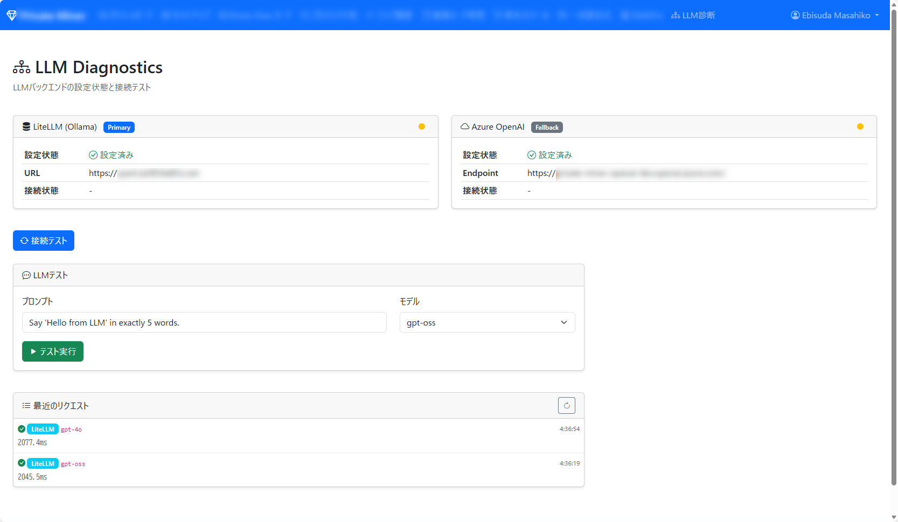

<!-- _class: lead -->


# HCCJP 第70回勉強会

## ハイブリッドクラウド研究会

**2026年2月13日（金）14:00開始**

---

<!-- _class: lead -->

# ローカルLLMで
# クラウドアプリもAI使い放題！

## NVIDIA DGX Spark × Azure ハイブリッド構成

---

<!-- _class: lead -->


# オープニング

**司会：胡田 昌彦**
<span class="speaker">日本ビジネスシステムズ株式会社<br>Microsoft MVP for Cloud and Datacenter Management, Microsoft Azure</span>

---

<!-- _class: small -->

# タイムテーブル

| 時刻 | 内容 | スピーカー |
|------|------|------------|
| 14:00 (5分) | オープニング | 胡田 昌彦（JBS / MVP） |
| 14:05 (45分) | ローカルLLMでAI使い放題！DGX Spark × Azure | 胡田 昌彦 |
| 14:50 (10分) | Q&A | 匿名で質問できます！ |
| 15:00 (10分) | Adaptive Cloud Updates（ビデオ） | 高添 修 氏（日本MS） |
| 15:10 (5分) | Q&A | 何でも質問できます！ |
| 15:15 (5分) | クロージング | 胡田 昌彦 |

---

<!-- _class: small -->


# HCCJPとは

## ハイブリッドクラウド研究会

- 毎月第2金曜日 14時から開催
- Azure + ハイブリッドクラウド関連の最新情報
- オンライン配信（YouTube HCCJPチャンネル）

📺チャンネル登録お願いします！

---

# 本日の注意事項

- 📹 配信は録画されています（アーカイブ視聴可）
- 💬 質問・コメント大歓迎！
- 📝 Q&Aセッションでまとめてお答えします

---

# 質問・コメント方法

## 💬 YouTubeチャットで質問・コメント大歓迎！

- 右側のライブチャット欄から投稿してください
- セッション中でもお気軽にどうぞ
- 固定コメントに各種リンクを掲載します

---

<!-- _class: lead -->

# セッション①

## ローカルLLMでAI使い放題！
## NVIDIA DGX Spark × Azure

**胡田 昌彦**

⏱️ 14:05 - 14:50（45分）

---

# 今日の話は私の体験談です

- Azure AI Foundry でエージェント開発
- DGX Spark を評価機として入手 → ローカルに移行
- ハマったポイントも全部リアルな経験

## ⚠️ この分野は変化が超高速！

- **2026年2月時点**の情報です
- LLMの対応API、ツールの機能は**数週間で変わる**
- **必ず最新の状況を確認してください！**

---

<!-- _class: lead -->

# Part 1
# Azure AI Foundry での開発

---

# Azure AI Foundry でエージェントを作った

## Azure Agent SDK でAIエージェント開発

- Azure AI Foundry 上で **Azure Agent SDK** を使用
- エージェントがLLMを呼び出してタスクを自律実行
- 大量の社内ドキュメントからナレッジを抽出して共有可能な形態とするアプリを開発

→ **ちゃんと動いた！うまくいっていた**

---

# でも…課金がキツい

## 実験で溶けていくAPI費用

- 開発中はトライ＆エラーの連続
- 失敗してもリトライしても**全部課金**
- 実験にかなりのお金を溶かしていた
- 精神的プレッシャーも大きかった

→ **「気軽に試せる環境がほしい！」**

---

<!-- _class: lead -->

# Part 2
# DGX Spark 入手！

---

# DGX Spark を評価機として入手！

- デスクトップサイズの**AIスーパーコンピュータ**
- **128GB統合メモリ**（CPU/GPU共有）
- **240W**でシステム全体が動く（省電力！）
- 価格: 国内70〜80万円台
- 購入希望者はお問い合わせください！

→ **固定費で、好きなだけローカルLLMを叩ける！**

---

<!-- _class: point -->

# 128GBメモリの威力

## 大規模モデルがローカルで動く

- 通常のGPU: 24GB → 70Bモデルが限界
  - メモリの大きいGPUはお値段も超お高い！
    - 数百万～数千万…（汗
- DGX Spark: 128GB → **120Bモデルも余裕なのに安い！**

---

<!-- _class: lead -->

# Part 3
# ローカルLLM環境構築

---


# Agent SDK は Responses API で動いている

## Azure のプログラムをそのまま使いたい

| | Chat Completions | Responses API |
|---|---|---|
| 状態管理 | **クライアント側** | **サーバー側** |
| 会話継続 | 毎回全履歴送信 | `previous_response_id` |
| ビルトインツール | なし | Web検索、ファイル検索等 |

→ ローカルでも **Responses API** が使えれば移行できる！

---

<!-- _class: point -->

# Ollama だけでは足りない

- Ollama v0.13.3以降: `/v1/responses` 対応済み
  - ※私が試していたときにはそもそも未対応だった
- ただし **stateful（セッション継続）は未対応**
- Agent SDK は `previous_response_id` で会話継続する

→ **LiteLLM** を間に挟めば解決！

---

# 構成: Ollama + LiteLLM

<div class="arch-box">

```
+---------------------------------------------------+
|                 DGX Spark (128GB)                 |
|                                                   |
|  +------------+      +--------------------+       |
|  |   Ollama   |<-----|      LiteLLM       |<- API |
|  | (LLM実行)  |      | (統合プロキシ)     |       |
|  |            |      |                    |       |
|  | - qwen3    |      | - Responses API    |       |
|  | - llama3   |      | - セッション継続   |       |
|  | - gemma3   |      | - ルーティング     |       |
|  +------------+      +--------------------+       |
+---------------------------------------------------+
```
</div>

---

<!-- _class: point -->

# コードがそのまま動いた！

- エンドポイントURLを変えただけ
- Agent SDK のコードは**一切変更なし**
- Responses API 互換のおかげ

→ **クラウド → ローカル移行がスムーズ！**

---

# LiteLLM の価値

- **100以上のLLMプロバイダー統合**
- **セッション継続**（previous_response_id対応）
- **自動フェイルオーバー/ルーティング**
- コストトラッキング、レート制限

→ ローカル × クラウドの**統合ハブ**として最適
※ListeLLM自体の冗長化等要検証…。

---

<!-- _class: point -->

# 今回はヘッドレス構成

- DBなし、管理UIなし
- **設定ファイル1つで完結**
- 統合APIだけ使いたい用途に最適

---

<!-- _class: lead -->

# Part 4
# Azure × オンプレ ハイブリッド

---

# 全体構成

<!-- 🎨 画像生成プロンプト:
Create a professional network architecture diagram showing a hybrid cloud setup:
LEFT SIDE (labeled "Azure Cloud", blue background):
- "Azure App Service (Private Miner)" box at top
- "Azure OpenAI (Pay-per-use)" box at bottom
- A dashed arrow labeled "Fallback" from App Service to Azure OpenAI
RIGHT SIDE (labeled "On-Premises", green background):
- "DGX Spark" box containing "Ollama + LiteLLM"
- Below it: "https://spark.xxx.ts.net"
CONNECTION between sides:
- Solid arrow from Azure App Service to DGX Spark, labeled "Tailscale Funnel (HTTPS)"
Style: clean flat design, two-tone (blue for cloud, green for on-prem), white background, suitable for tech presentation. No 3D effects.
-->

<div class="arch-box">

```
+----------------------+       +----------------------------+
|        Azure         |       |      オンプレミス          |
|                      |       |                            |
| +------------------+ | HTTPS |  https://spark.xxx.ts.net  |
| | Azure App Service|-|------>|            |               |
| | (AI駆動Webアプリ)| |       |            | Tailscale     |
| +------------------+ |       |            v Funnel        |
|         |            |       | +------------------------+ |
|         | Fallback   |       | |       DGX Spark        | |
|         v            |       | |   Ollama + LiteLLM     | |
| +------------------+ |       | +------------------------+ |
| |   Azure OpenAI   | |       |                            |
| |  (従量課金)      | |       +----------------------------+
| +------------------+ |
+----------------------+
```
</div>

---

<!-- _class: point -->

# Tailscale Funnel

## VPNなしでインターネット公開

```
tailscale funnel --bg 8080
```

→ `https://spark.xxx.ts.net` で公開

※Azureなら企業ならVPNやExpressRouteで接続している環境が多いためそれを使えばよい。今回は自宅環境のためTailscale Funnelを利用した。

---

<!-- _class: point -->

# フェイルオーバー構成

<!-- 🎨 画像生成プロンプト:
Create a simple failover flow diagram:
1. "API Request" arrow enters from the left
2. First node: "DGX Spark (Primary)" with label "Free / Unlimited" - highlighted in green
3. If DGX Spark fails (red X mark), arrow goes down to:
4. Second node: "Azure OpenAI (Fallback)" with label "Pay-per-use" - highlighted in blue
5. Both nodes have an arrow pointing right to "Response"
Style: flowchart style, clean, minimal, green for primary path, blue for fallback path, white background.
-->

1. **Primary**: DGX Spark（使い放題）
2. **Fallback**: Azure OpenAI（従量課金）

→ ローカル障害時も継続稼働

---

<!-- _class: point -->

# AI駆動Webアプリ

- Azure App Service で稼働
- 社内ドキュメントからナレッジ抽出
- **データを外に出さずにAI活用**

---

<!-- _class: lead -->

# 苦労話

---

<!-- _class: point -->

# DGX Sparkへのリモートデスクトップで5時間溶かした

- 設定アプリがハングアップ
- RDP証明書エラー
- **Wi-Fi経由だと繋がらない**（有線固定で解決）

教訓: **tcpdumpでSYN確認が最強の切り分け**

---

<!-- _class: point -->

# apt更新でGPGキー期限切れ

- NVIDIA Workbenchの署名が期限切れ
- GPGキーを手動更新で解決

---

<!-- _class: point -->

# nvidia-smi エラー

- DGX Dashboardで「Update」→ 動かなくなった
- **再起動で解決**（ドライバ更新後は要再起動）

---

<!-- _class: lead -->

# 🎬 デモ

---

<!-- _class: point -->

# デモ内容

1. **DGX Spark の状態確認**
   - free -h、nvidia-smi、ollama list

2. **Open WebUI でチャット**
   - http://192.168.1.3:3000

---

# Webアプリ診断画面


※実際のURLが漏洩すると色々と面倒なためデモは割愛します🙏

---

# 効果 / 感想
- ローカルLLMで**好きなだけ実験可能**
- Azure Agent SDK のコードは**一切変更不要**
- LLMを常時利用し続けてもお金の心配無し！
- 電力も騒音も全然OK！自宅においても問題なし！
- エンジニアには一人一台欲しい！将来そうなるかも。


---

<!-- _class: lead -->

# バイブコーディングの話

---

<!-- _class: point -->

# 全部 Claude Code で作った

- アプリ全体
- Azure インフラ（Bicep、CI/CD）
- DGX Spark 環境構築
- このスライドも
- connpass イベントも

自分はできたものをレビュー&微調整しただけ

---

<!-- _class: point -->

# でもAIだけでは作れなかったもの

- 「ローカルLLM × Azure」という**発想**
- 「LiteLLMで統合する」という**要件発見**
- 「Tailscale Funnelで公開」という**設計判断**

## AIは「How」、人間が「What」を決める

---

# まとめ

1. **DGX Spark**: 120Bモデルがローカルでサクサク動く
2. **LiteLLM**: 統合・ルーティング・セッション継続
3. **Tailscale Funnel**: インターネット公開
4. **フェイルオーバー**: Azure OpenAIと連携

**ローカルLLM × クラウドのハイブリッド構成はアイデア次第で革命を起こせる！**

---

<!-- _class: lead -->

# Q&A

## 💬 質問にお答えします！

- どんな質問でも大歓迎です

⏱️ 14:50 - 15:00（10分）

---

<!-- _class: lead -->

# セッション②（ビデオ）

## Microsoft "Adaptive Cloud" Updates

**高添 修 氏**
<span class="speaker">日本マイクロソフト株式会社</span>

⏱️ 15:00 - 15:10（10分・ビデオ登壇）

---

<!-- _class: lead -->

# Q&A

## 💬 質問にお答えします！

- どんな質問でも大歓迎です

⏱️ 15:10 - 15:15（5分）

---


# 📺 チャンネル登録を！

## 目指せ 1000人！

**YouTube HCCJPチャンネル**

毎月第2金曜日の最新情報をお見逃しなく！

---

<!-- _class: lead -->


# クロージング

## 本日のご参加ありがとうございました！

- アーカイブはYouTubeチャンネルから視聴可能
- 資料は後日公開予定
- ハッシュタグは **#HCCJP**

---

<!-- _class: lead -->

# 次回予告

## 📅 2026/3/13 14:00〜

次回の内容は調整中です！
希望あればコメントで！

最新情報は YouTube・X でお知らせ！

---

<!-- _class: lead -->


# ご参加ありがとうございました！

## また次回お会いしましょう！
