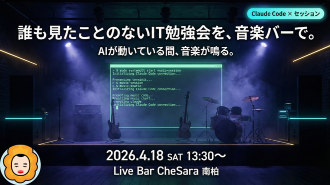

<!-- _class: lead -->


# HCCJP 第71回勉強会

## ハイブリッドクラウド研究会

**2026年3月13日（金）14:00開始**

---

<!-- _class: lead -->

# AI時代の
# 「本当の」ハイブリッドクラウド

## エージェントが実現した、あの頃の夢

---

<!-- _class: lead -->


# オープニング

**司会：胡田 昌彦**
<span class="speaker">日本ビジネスシステムズ株式会社<br>Microsoft MVP for Cloud and Datacenter Management, Microsoft Azure</span>

---

<!-- _class: small -->

# タイムテーブル

| 時刻 | 内容 | スピーカー |
|------|------|------------|
| 14:00 (5分) | オープニング | 胡田 昌彦（JBS / MVP） |
| 14:05 (40分) | AI時代の「本当の」ハイブリッドクラウド | 胡田 昌彦 |
| 14:45 (10分) | Q&A | 全員 |
| 14:55 (20分) | Microsoft "Adaptive Cloud" 最新動向 | 高添 修 氏（日本マイクロソフト） |
| 15:15 (10分) | Q&A | 高添 修 氏 |
| 15:25 (5分) | クロージング | 胡田 昌彦 |

---


# HCCJPとは

## ハイブリッドクラウド研究会

- 毎月第2金曜日 14時から開催
- Azure + ハイブリッドクラウド関連の最新情報
- オンライン配信（YouTube HCCJPチャンネル）

📺チャンネル登録お願いします！

---

# 本日の注意事項

- 📹 配信は録画されています（アーカイブ視聴可）
- 💬 質問・コメント大歓迎！
- 📝 Q&Aセッションでまとめてお答えします

---

# 質問・コメント方法

## 💬 YouTubeチャットで質問・コメント大歓迎！

- 右側のライブチャット欄から投稿してください
- セッション中でもお気軽にどうぞ
- 固定コメントに各種リンクを掲載します

---

<!-- _class: lead -->

# セッション①

## AI時代の「本当の」ハイブリッドクラウド
## エージェントが実現した、あの頃の夢

**胡田 昌彦**

⏱️ 14:05 - 14:45（40分）

---

# 👨‍💻 自己紹介

## 胡田 昌彦（えびすだ まさひこ）

- 🏢 **日本ビジネスシステムズ株式会社（JBS）**
- 🏆 **Microsoft MVP** — Cloud and Datacenter Management / Microsoft Azure
- 📖 著書: **「Windowsインフラ管理者入門」**
- 📺 YouTube: https://youtube.com/@ebibibi
- 🌐 Web: https://ebisuda.net/
- 🎵 趣味: ベース、ドラム、セッション、将棋

---

<!-- _class: lead -->

# Part 1
# HCCJPの原点と「あの頃の夢」

---

<!-- _class: point -->

# 問いかけ

## 「ハイブリッドクラウド」「マルチクラウド」

## 本当に実現してましたか？

---

# 2018年〜 HCCJP立ち上げの頃

- 「ハイブリッドクラウド」は**ホットワード**だった
- Azure Stack (HUB)、AWS Outposts、Google Anthos…
- 各ベンダーが「ハイブリッドこそ未来」と言っていた

**でも…**

---

<!-- _class: point -->

# 正直なところ

- 1つのシステムは**1箇所にまとまって動く**のが普通
- オンプレはオンプレ、クラウドはクラウド
- 「ハイブリッド」はネットワーク接続がメイン。管理コンソールの統合...までもなかなか行けなかった
- 1システム内でのワークロードの分散配置や移動ではなかった

→ **本当にハイブリッドに跨って動くシステムは少なかった**

---

<!-- _class: lead -->

# Part 2
# 時代は変わった

---

<!-- _class: point -->

# 2025-2026年、AIエージェントの時代

- AIエージェント多数登場&進化中
  （Claude Code, Codex, Gemini CLI, GitHub Copilot CLI, Devin…）
- **1つのAIエージェントが、複数の場所を跨いで動く**

→ これ、**本当のハイブリッドクラウド**じゃない？

---

<!-- _class: lead -->

# Part 3
# 3つの要素 × 3つの配置先

---

<!-- _class: point -->

# ⚠️ 今日一番伝えたいことの１つ！

## 難しいけどよく理解が必要！
※製品名・サービス名は覚えなくてOK。
**注目してほしいのは表の中身ではなく「表の構造」そのもの。**

---

# AIエージェント時代のハイブリッドを整理する

<!-- _class: small -->

## 3つの要素が、それぞれ自由な場所に配置される

<table>
<tr><th></th><th><span class="tag-onpre">オンプレ</span></th><th><span class="tag-cloud">クラウド基盤（IaaS/PaaS）</span></th><th><span class="tag-saas">SaaS</span></th></tr>
<tr><td><b>モデル(実行基盤)</b></td><td>Ollama, vLLM等</td><td>Microsoft Foundry等</td><td>OpenAI API, Anthropic API, Google AI API等</td></tr>
<tr><td><b>エージェントソフト</b></td><td colspan="2">自作, Claude Code, Codex, Gemini CLI, GitHub Copilot CLI　など</td><td>GitHub Copilot Coding Agent, Claude Code on the Web, Devin　など</td></tr>
<tr><td><b>コンテキスト</b></td><td colspan="2">ファイル（CLAUDE.md, フォルダ構造で工夫）/ Gitレポジトリ, GitLab / DB・ベクトルストア など</td><td>GitHubレポジトリ, Copilot Spaces, M365, WorkIQ, Google Workspaces, Notion 等(※API, MCP経由でどこでもつながる)</td></tr>
</table>

- **3要素(それぞれ選択肢膨大) × 3配置先 = 無数の組み合わせ**
- それぞれが別々の場所にあっていい

---

<!-- _class: lead -->

# Part 4
# 具体例で見てみよう

---

<!-- _class: small -->

# 例1: M365 Copilot — フルSaaS構成

<div class="arch-box">

```
+-------------------------------------------------------+
|                  Microsoft 365 (SaaS)                 |
|                                                       |
| +------------+   +--------------+   +--------------+  |
| |   OpenAI   |   | M365 Copilot |   |    WorkIQ    |  |
| |  (モデル)  |<--|(エージェント)|<--| SP/Teams/    |  |
| +------------+   +--------------+   | Outlook/OD   |  |
|                                     +--------------+  |
+-------------------------------------------------------+
```
</div>

- **モデル** <span class="tag-saas">SaaS</span> / **エージェントソフト** <span class="tag-saas">SaaS</span> / **コンテキスト** <span class="tag-saas">SaaS</span>
- → **すべてSaaS。多くの企業が最初に触れるAIエージェント体験**

---

<!-- _class: small -->

# 例2: 典型的なRAG構成（Azure）

<div class="arch-box">

```
+----------------------------------------------------+ 
|                   Azure (クラウド基盤)              |
|                                                     |
| +--------------------+   +-----------------------+  |
| | Microsoft Foundry  |   | Azure AI Search       |  |
| | (モデル)           |<--| (ベクトルストア)      |  |
| +--------------------+   | + Blob Storage        |  |
|          ^               +-----------------------+  |
|          |                                          |
| +--------+-----------+                              |
| | Azure App Service  |                              |
| | (自作Webアプリ)    |                              |
| +--------------------+                              |
+----------------------------------------------------+ 
```
</div>

- **モデル** <span class="tag-cloud">クラウド基盤</span> / **エージェントソフト** <span class="tag-cloud">クラウド基盤</span> / **コンテキスト** <span class="tag-cloud">クラウド基盤</span>
- → **すべてクラウド基盤。自前で構築・管理する典型的なエンタープライズ構成**

---

<!-- _class: small -->

# 例3: 典型的なRAG構成（オンプレ）

<div class="arch-box">

```
+----------------------------------------------------+  
|                 社内データセンター (オンプレ)        |
|                                                      |
| +--------------------+   +-----------------------+   |
| | Ollama / vLLM      |   | PostgreSQL pgvector   |   |
| | (GPU搭載サーバー)  |<--| / Elasticsearch       |   |
| +--------------------+   | (ベクトルストア)      |   |
|          ^               +-----------------------+   |
|          |                                           |
| +--------+-----------+                               |
| | 自作Webアプリ      |                               |
| | (社内サーバー)     |                               |
| +--------------------+                               |
+----------------------------------------------------+  
```
</div>

- **モデル** <span class="tag-onpre">オンプレ</span> / **エージェントソフト** <span class="tag-onpre">オンプレ</span> / **コンテキスト** <span class="tag-onpre">オンプレ</span>
- → **すべてオンプレ。データを外に出せない要件がある場合の構成**

---

# 例4: GitHub Copilot CLI

<!-- _class: small -->

<div class="arch-box">

```
+-------------------+          +------------------------+
|    ローカル       |          |    GitHub (クラウド)   |
|                   |          |                        |
| +---------------+ |          | Repository             |
| | ソースコード  | |   API    | Issues / Discussions   |
| | copilot-      |<|--------->| Copilot Spaces         |
| | instructions  | |          +------------------------+
| +---------------+ |          | モデル選択             |
|        |          |          |  GPT / Claude /        |
|   Copilot CLI     |          |  Gemini                |
|  (エージェント)   |          +------------------------+
+-------------------+
```
</div>

- **モデル** <span class="tag-saas">SaaS</span> GPT / Claude / Gemini（選択可）
- **エージェントソフト** <span class="tag-onpre">オンプレ</span> Copilot CLI（ローカルPC）
- **コンテキスト** <span class="tag-onpre">オンプレ</span> ソースコード等 + <span class="tag-saas">SaaS</span> GitHub Issues, Copilot Spaces

---

# 例5: 私の環境（Claude Code）

<!-- _class: small -->

<div class="arch-box">

```
+-------------------+          +------------------------+
|    ローカル       |          |       クラウド         |
|                   |          |                        |
| +---------------+ |          | Anthropic API (推論)   |
| | Obsidian      | |   API    | Todoist API            |
| | CLAUDE.md     |<|--------->| Google Calendar API    |
| | ソースコード  | |          | GitHub                 |
| | skills/       | |          | Azure                  |
| +---------------+ |          | Discord API            |
|        |          |          +------------------------+
|   Claude Code     |
|  (エージェント)   |
+-------------------+
```
</div>

- **モデル** <span class="tag-saas">SaaS</span> Anthropic API
- **エージェントソフト** <span class="tag-onpre">オンプレ</span> Claude Code（ローカルPC）
- **コンテキスト** <span class="tag-onpre">オンプレ</span> CLAUDE.md, Obsidian等 + <span class="tag-saas">SaaS</span> GitHub, Todoist等
  - 必要な情報はClaude Code自体が必要に応じてエージェンティックに取得する

---

<!-- _class: small -->

# 例6: 前回(第70回)の勉強会の例（DGX Spark × Azure）

<div class="arch-box">

```
+------------------------+       +----------------------------+
|         Azure          |       |       オンプレミス         |
|                        |       |                            |
| +--------------------+ | HTTPS |  https://spark.xxx.ts.net  |
| | Azure App Service  |-|------>|            |               |
| | (自作エージェント) | |       |            v Tailscale     |
| +--------------------+ |       | +------------------------+ |
|          |             |       | |       DGX Spark        | |
|          | Fallback    |       | |   Ollama + LiteLLM     | |
|          v             |       | +------------------------+ |
| +--------------------+ |       |                            |
| | Microsoft Foundry  | |       +----------------------------+
| | (従量課金)         | |
| +--------------------+ |
+------------------------+
```
</div>

- **モデル** <span class="tag-onpre">オンプレ</span> DGX Spark + <span class="tag-cloud">クラウド基盤</span> Microsoft Foundry（フォールバック）
- **エージェントソフト** <span class="tag-cloud">クラウド基盤</span> 自作（Azure Agent SDK on App Service）
- **コンテキスト** <span class="tag-saas">SaaS</span> SharePoint内の社内ドキュメント

---

<!-- _class: lead -->

**同じモデルでも、エージェントソフトが違えば動きが違う。**
**同じエージェントソフトでも、配置先が違えば使い方が変わる。**

---

<!-- _class: lead -->

# Part 5
# AIエージェントにおける「引き継ぎ」

---

<!-- _class: point -->

# 問いかけ

## エージェントの「作業」を
## 別の場所に持っていけるとしたら？

VM時代は「移行」に数時間〜数日かかった
AIエージェント時代は？

---

<!-- _class: small -->

# Remote Control — UIだけリモート

## （2026/02/24 発表 · Max/Proプラン）

<div class="arch-box">

```
+-----------------------+             +------------------+
|     ローカルPC        |             |    claude.ai     |
|                       |             |                  |
| Claude Code（実行中） |  <--TLS-->  | Web / モバイルUI |
| - ファイルシステム    |             | QRコードで即接続 |
| - MCP サーバー        |             | スマホでも操作可 |
| - プロジェクト設定    |             |                  |
+-----------------------+             +------------------+
 コードはローカルに留まる！メッセージだけが流れる
```
</div>

- `claude remote-control` または `/rc` で起動
- 受信ポートは一切開かない（アウトバウンドHTTPSのみ）
- **モデル** <span class="tag-saas">SaaS</span> / **エージェントソフト** <span class="tag-onpre">オンプレ</span> / **コンテキスト** <span class="tag-onpre">オンプレ</span>
- **操作UI** <span class="tag-saas">SaaS</span> claude.ai（Web / モバイル）← 実行はオンプレのまま

---

<!-- _class: small -->

# Claude Code on the Web — クラウドで自律実行

<div class="arch-box">

```
PC Terminal:
  claude --remote "認証バグを修正して"
        ↓
+-------------------------------+
| Anthropic 管理クラウドVM      |
| - GitHub リポジトリをクローン |
| - テスト実行・コード修正      |
| - PR 作成まで自律実行         |
+-------------------------------+
        ↓
  claude --teleport  ← ローカルに持ち帰り可能
  （会話履歴 + ブランチごと）
```
</div>

- **並列実行可能**：`--remote` を複数回叩けばタスクが並走
- Web → ローカルの一方向ハンドオフ（逆は新規セッション）
- **クラウド実行時**: **モデル** <span class="tag-saas">SaaS</span> / **エージェントソフト** <span class="tag-saas">SaaS</span> / **コンテキスト** <span class="tag-saas">SaaS</span>（GitHub経由のみ）
- **teleport後**: **モデル** <span class="tag-saas">SaaS</span> / **エージェントソフト** <span class="tag-onpre">オンプレ</span> / **コンテキスト** <span class="tag-onpre">オンプレ</span> + <span class="tag-saas">SaaS</span>
  - ローカルファイル・MCP・認証情報が加わり、コンテキストを大幅に拡張できる

---

<!-- _class: small -->

# 2つの「引き継ぎ」パターン

| | Remote Control | Cloud on the Web<br>（クラウド実行時） | Cloud on the Web<br>（teleport後） |
|--|---|---|---|
| 実行場所 | **ローカルPC** | クラウドVM | **→ ローカルPC** |
| 会話履歴 | そのまま継続 | クラウドに蓄積 | **✅ ローカルに引き継ぎ** |
| コンテキスト | ✅ 全てアクセス可 | ❌ GitHub経由のみ | **✅ 全て + 会話履歴も引き継ぎ** |
| MCP サーバー | ✅ 使える | ❌ 使えない | **✅ 使える** |
| 並列実行 | ❌ 1セッション | ✅ 何タスクでも | — |

**共通点: VMを引っ越すより圧倒的に軽い**
→ これが「本当のハイブリッド」を可能にする

---

<!-- _class: lead -->

# Part 6
# なぜ今「本当のハイブリッド」なのか

---

<!-- _class: small -->

# 昔と今の決定的な違い

| | VM時代 | AIエージェント時代 |
|--|--------|-----------------|
| 移動対象 | VM（数十GB〜） | 会話・設定ファイル（数KB〜MB）・コンテキスト |
| 移動コスト | 高い（ダウンタイム） | ほぼゼロ |
| 構成の自由度 | ベンダーロックイン | ツール・モデル・場所を自由選択 |
| 標準化 | 各社独自 | MCP, OpenAI互換API等 |
| 最強の頭脳 | 自社で構築・運用可能 | **外部サービスに依存せざるを得ない** |
| 乗り換えコスト | 高い（再構築・移行） | ほぼゼロ（モデル・ツールを即座に切替可） |

**モビリティが高い + 最強モデルは外部 + 乗り換えコストほぼゼロ**
→ ハイブリッド/マルチクラウドが「必然」になる

---

<!-- _class: small -->

# 標準化の波

- **MCP**（Model Context Protocol） — エージェントとツール・データの接続標準
- **A2A**（Agent2Agent Protocol） — エージェント間の通信・タスク委任標準
- **CLAUDE.md / AGENTS.md / GEMINI.md** — エージェント設定のファイル化
- **Agent Skills** — 再利用可能な知識パッケージ（クロスプラットフォーム）
- **OpenAI互換API** — 異なるモデルプロバイダーを同じIFで

→ **Agentic AI Foundation**（Linux Foundation, 2025/12〜）で中立的に推進中

標準化 = ポータビリティ = ハイブリッド/マルチクラウドの基盤

---

<!-- _class: point -->

# 人の数だけ構成がある

- Aさん: Claude Code + Obsidian + Azure
- Bさん: Copilot CLI + GitHub + AWS
- Cさん: Cursor + Notion + GCP
- Dさん: ローカルLLM + VS Code + オンプレ

**同じ「AIでコーディング」でも構成は十人十色**

---

<!-- _class: lead -->

# 🧠 頭の体操タイム

---

# あなたの環境を整理してみよう

## 3つの要素で考えてみてください

1. **モデル**: どのLLMを、どこで動かしている？
2. **エージェントソフト**: どのソフトを使っている？ローカル？SaaS？
3. **コンテキスト**: 情報はどこに、どんな形で持っている？何が使えれば便利？

もしも制約がないなら、どんな構成にしたいですか？

---

<!-- _class: lead -->

# Part 7
# AIエージェントの動力源 = API

---

<!-- _class: point -->

# AIエージェントは
# APIがなければ
# 手も足も出ない

---

<!-- _class: small -->

# エージェントが仕事をする仕組み

## 外部サービスへのアクセス = すべてAPI経由

| 操作 | 手段 |
|------|------|
| ファイル読み書き | OS API（ローカル） |
| コマンド実行 | シェル = 広義のAPI |
| Git操作 | git コマンド / GitHub API |
| カレンダー | Google Calendar API |
| Azureリソース | Azure Resource Manager API |
| 複数ツール統合 | MCP（内部でREST API等を呼び出し） |

MCPも結局は**裏でAPIを叩いている**。標準化で抽象化されても、土台はAPI。

**APIがない場所 = エージェントが「触れない場所」**

---

<!-- _class: point -->

# クラウドはAPIが当たり前

- Azure: Resource Manager API、Storage API、Kubernetes API…
- AWS / GCP: 全リソースがREST API経由
- **エージェントにとってクラウドは「天国」**
  - 読める・作れる・消せる・設定できる → すべてAPIで自在に

---

<!-- _class: small -->

# 💬 Kelsey Hightower（Google / Kubernetes）

## "No one wants to manage infrastructure.<br>They want to consume it via API."

- Kubernetes の生みの親の一人
- 「インフラはAPIで消費するもの」という思想を一貫して主張
- KubernetesはオンプレをAPIで包む「プラットフォームのプラットフォーム」

この哲学がそのままAIエージェント時代の答えになっている

---

<!-- _class: point -->

# オンプレミスは？
## APIが限定的だった

- 昔のシステム: GUIや独自プロトコルが中心
- 管理: 専用コンソールを人間が直接操作
- 自動化: スクリプト職人が個別に対応

**「手作業で困っていない」が通用した時代**

---

# AIエージェントの目線で見ると

| 環境 | APIの充実度 | エージェントの働ける範囲 |
|------|------------|----------------------|
| クラウド | ◎ 全操作がAPI化 | 自在に仕事できる |
| API整備済みオンプレ | ○ | かなり仕事できる |
| 従来型オンプレ | △〜× | 手を出せる範囲が限定的 |

**インフラのAPI化 = エージェントへの「権限委譲」が可能**

---

<!-- _class: small -->

# Azure Arcで実現する世界

## オンプレにも同じAPIと同じセキュリティモデルを

- **Azure Local** → オンプレのインフラをAzure APIで操作
- **Arc-enabled Servers** → 普通のサーバーもAzure Resource Managerで管理
- **Arc-enabled Kubernetes** → 既存のK8sクラスターをAzure APIで管理
- **AKS enabled by Azure Arc** → Azure Local上でAKSを運用
- **Arc-enabled Data Services** → DBもAzure APIで運用

→ **API** だけでなく **Azure RBAC** も統一される
→ エージェントから見ると「クラウドとオンプレの差がなくなる」

---

<!-- _class: small -->

# クラウドとオンプレを同じAPIと同じRBACで

<div class="arch-box">

```
AIエージェント（Claude Code / Cursor / Copilot...）
              | 同じ API + 同じ RBAC
+-------------------------------------+
|       Azure Resource Manager        |
|     (API + RBAC + Azure Policy)     |
+------------------+------------------+
| Azure (クラウド) |  オンプレミス    |
|  - VMs           |  - Azure Local   |
|  - AKS           |  - Arc Servers   |
|  - Databases     |  - AKS Arc       |
|  - Functions     |  - Arc Data Svc  |
+------------------+------------------+
```
</div>

**エージェントは自由に動ける。管理者はRBACで権限をコントロールできる。**

---

<!-- _class: point -->

# Azure Arc =
# AIエージェントにとって最高の環境

- **API**: クラウドもオンプレも同じように操作できる
- **RBAC**: 一貫したセキュリティモデルで権限制御
- **自由 × 統制**: エージェントは縦横無尽、管理者はしっかり制御

---

<!-- _class: small -->

# 「セルフサービス化・クラウドネイティブ化」の真の意味

| 時代 | 理解されにくかった理由 | AIエージェント時代の説明 |
|------|------------------|----------------------|
| 従来 | 「手作業で困ってません」 | ✗ 刺さらない |
| AI時代 | 「APIがないとエージェントが仕事できません」 | ✓ 即わかる |

**インフラを整えることの意味が、初めて全員に伝わる時代**

---

<!-- _class: lead -->

# まとめ
# じゃあ、何をすればいいのか

---

<!-- _class: small -->

# もう一度この表を見てみよう

<table>
<tr><th></th><th><span class="tag-onpre">オンプレ</span></th><th><span class="tag-cloud">クラウド基盤（IaaS/PaaS）</span></th><th><span class="tag-saas">SaaS</span></th></tr>
<tr><td><b>モデル(実行基盤)</b></td><td>Ollama, vLLM等</td><td>Microsoft Foundry等</td><td>OpenAI API, Anthropic API, Google AI API等</td></tr>
<tr><td><b>エージェントソフト</b></td><td colspan="2">自作, Claude Code, Codex, Gemini CLI, GitHub Copilot CLI　など</td><td>GitHub Copilot Coding Agent, Claude Code on the Web, Devin　など</td></tr>
<tr><td><b>コンテキスト</b></td><td colspan="2">ファイル（CLAUDE.md, フォルダ構造で工夫）/ Gitレポジトリ, GitLab / DB・ベクトルストア など</td><td>GitHubレポジトリ, Copilot Spaces, M365, WorkIQ, Google Workspaces, Notion 等(※API, MCP経由でどこでもつながる)</td></tr>
</table>

- 🧠 **モデル** → 用途に合わせて自由に選択すればいい
- 🤖 **エージェントソフト** → その時々の最強を使えばいい
- 🏃 **配置先** → 本質的にどこでもOK。きちんと整備しておけばいい
- ⚡ **前提: すべてにAPIがあること**（APIがなければエージェントは動けない）

**→ APIさえあればAIエージェント側は自由に動ける。残るのは…？**

---

<!-- _class: point -->

# 残るのはコンテキスト

- M365、DB、社内システム、ファイルサーバー…
- **「動かせない既存の大量のデータやシステム」**
- これは企業ごとに全く違う。ここだけは自分たちで整備するしかない

---


# ここでもArcが効く

- 例：オンプレのファイルサーバーにもArcを入れて管理しておけば
  → **AIエージェントがそこにアクセスしてコンテキストを取得できる**
- Arcは「基盤の管理」だけでなく「コンテキストへの道」でもある
- **どこにあるデータにもエージェントが届く世界**を作る

→ コンテキストをAIエージェント向けに整備して、
　エージェントにガンガン動いてもらおう！
　**これがこれからのインフラ設計の核心**

※コンテキスト整備の具体的な方法論は、まだ自分もまとめきれていません。
　別の回で詳しく掘り下げたいと思います！

---

# これを実現した者が先行できる！

- 🧠 **モデル**: 自由に選び・切り替えられる設計
- 🏃 **実行環境**: API + RBACでどこでも動ける基盤（Arc!）
- 📜 **コンテキスト**: 自社のデータ・システムをエージェントに開放（Arc!）

→ **圧倒的な生産性優位**

他社がベンダーロックインや環境制約と格闘している間に、
この問いを解いた組織が次の時代を作る

---

<!-- _class: lead -->

# ありがとうございました！

## AI時代の「本当の」ハイブリッドクラウド

**胡田 昌彦**

---

<!-- _class: x-small -->



# 📢 勉強会のお知らせ

## Claude Codeライブ × 制約環境の自動化オフレコ
## 音楽バーで語るAI昼会 #1

- 📅 **2026年4月18日（土）13:30〜16:00**
- 📍 **Live Bar CheSara（南柏駅 徒歩1分）**
- 💰 **参加費無料**（ドリンクオーダー別途）

### 内容
- 🤖 参加者全員で「今日作るもの」を決めてClaude Codeに実装させる
- 🎵 AIがコード書いてる間は**生演奏セッション**！
- 🔒 オフレコセッション「会社のルールを守りながら、どこまで自動化できるか」

**Connpassで参加受付中！** https://ebisuda.connpass.com/event/385849/

---

<!-- _class: lead -->

# Q&A

## 💬 質問にお答えします！

- どんな質問でも大歓迎です

⏱️ 14:45 - 14:55（10分）

---

<!-- _class: lead -->


# セッション②

## Microsoft "Adaptive Cloud" 最新動向

**高添 修 氏**
<span class="speaker">日本マイクロソフト株式会社</span>

⏱️ 14:55 - 15:15（20分）

---

<!-- _class: lead -->

# Q&A

## 💬 質問にお答えします！

⏱️ 15:15 - 15:25（10分）

---

<!-- _class: lead -->


# クロージング

## 本日のご参加ありがとうございました！

- アーカイブはYouTubeチャンネルから視聴可能
- 資料は後日公開予定
- ハッシュタグは **#HCCJP**

---


# 📺 チャンネル登録を！

## 目指せ 1000人！

**YouTube HCCJPチャンネル**

毎月第2金曜日の最新情報をお見逃しなく！

---

<!-- _class: small -->

# 🙌 HCCJPを一緒に盛り上げませんか？

HCCJPは**企業・個人を問わず、誰でも参加できるオープンなコミュニティ**です。

今、特に**こんな仲間**を募集しています！

- 🏢 **ユーザー企業の担当者** — 「うちはこう使ってる」というリアルな導入事例の共有
- 💬 **構成相談したい方** — 「こういう構成どう？」をみんなで議論しましょう
- 🤖 **生成AI × インフラに興味がある方** — AI活用事例を持ち寄りましょう
- 🎤 **登壇してみたい方** — 初登壇も大歓迎！発表の場を提供します

---

<!-- _class: lead -->

# 次回予告

## 📅 2026/4/10（金）14:00〜

### 次回以降のセッション候補
- 🔧 **Arcでつないだら？Arc×AIエージェント実演セッション**
- 📜 **AIエージェントのコンテキスト整備の方法論**
- 🎤 **ネットワールド 後藤さん登壇！？**（ご快諾いただいてます！）

希望あればコメントで！

---

<!-- _class: lead -->


# ご参加ありがとうございました！

## また次回お会いしましょう！
