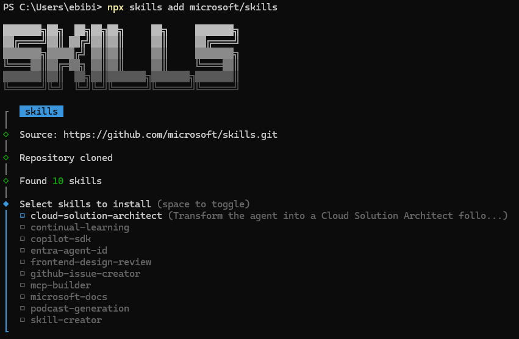

# AIエージェントに Azure を教える

## Microsoft公式 Agent Skills を読み解く

**HCCJP 第72回勉強会**
2026年4月10日（金）

胡田 昌彦
日本ビジネスシステムズ株式会社
Microsoft MVP for Cloud and Datacenter Management, Microsoft Azure

---

# 本日のアジェンダ

| 時刻 | セッション | スピーカー |
|------|-----------|-----------|
| 14:00 | オープニング | 胡田 |
| 14:05 | **AIエージェントに Azure を教える** | 胡田 |
| 14:45 | Q&A | 全員 |
| 14:55 | **Microsoft "Adaptive Cloud" Updates** | 高添 氏 |
| 15:15 | Q&A → クロージング | 全員 |

---

# HCCJPとは

- **Hybrid Cloud Community Japan**
- 2018年から続く勉強会コミュニティ
- ハイブリッドクラウドに関する知見を共有
- 毎月第2金曜日 14:00〜 オンライン開催

**主幹事:** 日本ビジネスシステムズ株式会社
**幹事:** NTTコミュニケーションズ、日商エレクトロニクス、日本HP、日本マイクロソフト、VistaNet、ネットワールド、三井情報、レノボ

---

<!-- _class: lead -->

# セッション①
## AIエージェントに Azure を教える
## — Microsoft公式 Agent Skills を読み解く

---

<!-- _class: lead -->

# まず、見てください

---

# デモ① Before: 素の Claude Code に Azure 操作を頼む

**Claude Code（スキル・MCP なし）**

> 「HCCJP 第72回勉強会のウェルカムページを作って、Azure Static Web Apps にデプロイして」

**→ 実演します（画面共有）**

予想される結果:
- それなりにうまくこなしてくれる。


---

# デモ② After: スキル＋MCP を入れた Claude に同じことを頼む

**Claude Codeに Agent Skills + Azure MCP Server を導入したうえで実行**
- /plugin marketplace add microsoft/azure-skills
- /plugin install azure@azure-skills
- /reload-plugins

> 「HCCJP 第72回勉強会のウェルカムページを作って、Azure Static Web Apps にデプロイして」

**→ 実演します（画面共有）**

---

<!-- _class: lead -->

# 何が起きたのか？
## ここからは「種明かし」です

---

# AIコーディングエージェントの現在地

- **Claude Code** / **GitHub Copilot** / **OpenAI Codex** ...
- コードを書くだけでなく、**インフラの設計・構築・運用**まで
- でも「Azure の正しい使い方」を知らないと...
  - 古いAPIを使う、ベストプラクティスに反する、セキュリティリスク

**→ AIエージェントに「正しいAzureの知識」を教える必要がある**

---

# Agent Skills とは？（30秒で）

- **AIエージェントに専門知識を与えるmarkdownファイル群**
- LLMは事前学習でAzureの知識を持っている。でも古い・不正確・ベストプラクティスの欠如・hallucinationのリスク
- スキル = **最新で正確な公式知識をコンテキストとして注入する仕組み**

```
plugins/marketplaces/azure-skills/skills/
├── appinsights-instrumentation/
│   └── SKILL.md          ← これがスキル本体
├── azure-ai/
│   └── SKILL.md
└── ...
```

---

# Microsoft公式: 3つのリポジトリ

| リポジトリ | 役割 | スキル数 |
|-----------|------|---------|
| **microsoft/skills** | SDK開発支援（コードの書き方） | 132 |
| **microsoft/azure-skills** | 運用支援（リソースの操作） | 24 + 2 MCP |
| **MicrosoftDocs/Agent-Skills** | サービス知識の百科事典 | 192 |

**3つは「レイヤーが違う」**
- skills = SDK開発支援—「Azure SDKを使ってどうコードを書くか」
- azure-skills = 運用支援—「Azureリソースをどう設計・デプロイ・管理するか」
- Agent-Skills = サービス知識—「各Azureサービスについて何を知るべきか」

---

# なぜ3つに分かれているのか？

**答え: 出自と目的が違う**

| リポジトリ | GitHub Org | 作成日 | 確認できた出自 |
|-----------|-----------|--------|--------------|
| **microsoft/skills** | `microsoft` | 2026-01-16 | Azure SDK / Foundry開発向けの Agent Skills リポジトリ |
| **microsoft/azure-skills** | `microsoft` | 2026-02-26 | Azure Skills Plugin。`GitHub-Copilot-for-Azure` から同期される plugin リポジトリ |
| **MicrosoftDocs/Agent-Skills** | `MicrosoftDocs` | 2026-01-27 | Microsoft Learn ドキュメントを事前コンパイルした skill 群 |

- 1月 — SDK/Foundry開発の skill catalog として登場
- 1月末 — Learn の知識を service skill として再構成
- 2月末 — skills + Azure MCP + Foundry MCP を束ねる plugin として公開

**→ 少なくとも公開情報から言えるのは、3つは別の目的と配布導線から生まれている、ということ**

---

# ① microsoft/skills（⭐1,900+）

**SDK開発支援 —「Azure SDKを使ってどうコードを書くか」を教える132 skills**

| 言語 | 数 | 例 |
|------|-----|-----|
| Core（共通） | 9 | cloud-solution-architect, mcp-builder, entra-agent-id |
| Python | 41 | azure-ai-projects-py, azure-cosmos-py |
| .NET | 28 | azure-ai-openai-dotnet, azure-search-documents-dotnet |
| TypeScript | 25 | azure-ai-projects-ts, azure-storage-blob-ts |
| Java | 25 | azure-ai-projects-java, azure-cosmos-java |
| Rust | 7 | （新規追加中） |

**`npx skills add microsoft/skills` で選択して入るのは、この132個の individual skill**

---

# ① npx skills add の実行画面



**→ Core 10個から必要なものだけ選んでインストール**
（言語別skillは `npx skills add microsoft/skills --language python` 等で絞り込み）

---

# ① microsoft/skills — SDK開発支援の詳細

| 構成要素 | 中身 |
|---------|------|
| **Skills** | 132個の個別skill。SDK/Foundry開発パターンを注入 |
| **Marketplace** | plugin名のカタログ。実体は各pluginリポジトリにある |
| **Agents** | backend / frontend / infrastructure / planner など |
| **Prompts** | code review、endpoint追加など再利用テンプレート |
| **MCP configs** | docs、GitHub、Playwrightなどの設定例 |

---

# ② microsoft/azure-skills（⭐560+）

**運用支援 —「Azureリソースをどう設計・デプロイ・管理するか」を教える統合プラグイン**

## 3層構造

| 層 | 役割 |
|----|------|
| **Skills（脳）** | 20個のキュレート済みスキル — ワークフロー、判断基準、ガードレール |
| **Azure MCP Server（手）** | 200+ツール × 40+サービス — リソース操作、価格確認、ログ照会 |
| **Foundry MCP（AI専門家）** | モデルカタログ、デプロイ、エージェントワークフロー |

---

# ② azure-skills の主要スキル

| スキル | 役割 |
|-------|------|
| **azure-prepare** | デプロイ前の設計・準備 |
| **azure-validate** | 構成の検証・チェック |
| **azure-deploy** | 実際のデプロイ実行 |
| **azure-diagnostics** | トラブルシューティング |
| **azure-cost-optimization** | コスト最適化 |
| **azure-compliance** | コンプライアンスチェック |
| **azure-rbac** | 権限管理 |
| **microsoft-foundry** | AI Foundry統合 |
| **entra-app-registration** | アプリ登録 |

**→ prepare → validate → deploy の3ステップが設計されている**

---

# ② ワンクリックインストール

```bash
# GitHub Copilot CLI
/plugin marketplace add microsoft/azure-skills
/plugin install azure@azure-skills

# Claude Code
/plugin marketplace add microsoft/azure-skills
/plugin install azure@azure-skills
```

**エージェントを選ばない。同じスキルが Copilot でも Claude Code でも動く。**

---

# ③ MicrosoftDocs/Agent-Skills（⭐450+）

**「Azureの各サービスについて何を知るべきか」の百科事典**

192個のスキルが **19カテゴリ** に分類:

| カテゴリ | 例 |
|---------|-----|
| 🤖 AI + ML | Azure AI Foundry, AI Search, Document Intelligence, Speech |
| ☁️ Compute | Functions, VM, Container Apps, AKS |
| 🗄️ Databases | Cosmos DB, SQL Database, PostgreSQL |
| 🔒 Security | Key Vault, DDoS Protection, Firewall |
| 🌐 Networking | VNet, Load Balancer, Front Door |
| 🌍 Hybrid + Multicloud | **Azure Arc, Azure Local, Stack HCI** |

---

# ③ 各スキルに含まれる知識

1つのスキルに含まれる情報カテゴリ:

- **Troubleshooting** — よくある問題と解決策
- **Best Practices** — 推奨パターン
- **Decision Making** — 「どんな時にこのサービスを選ぶか」
- **Architecture & Design Patterns** — 設計パターン
- **Limits & Quotas** — 制限事項（これ重要！）
- **Security** — セキュリティ考慮事項
- **Configuration** — 設定のベストプラクティス
- **Integrations & Coding Patterns** — 連携パターン
- **Deployment** — デプロイ手順

---

# ③ HCCJPメンバー注目: Hybrid + Multicloud

| スキル | 説明 |
|-------|------|
| **azure-arc** | Azure Arc でマルチクラウド/オンプレを統合管理 |
| **azure-aks-edge-essentials** | エッジでのKubernetes |
| **azure-stack-edge** | Azure Stack Edge デバイス |
| **microsoft-foundry-local** | Foundry をローカルで実行 |

**→ 前回（第71回）のテーマ「AI時代のハイブリッドクラウド」の延長線上にある**

---

# ③ azure-arc スキルの深さ（実例）

**9カテゴリ × 数十トピック** が1つのスキルに凝縮:

| カテゴリ | トピック数 | 例 |
|---------|----------|-----|
| Troubleshooting | 20+ | Kubernetes/Servers/SQL MI/Resource Bridge |
| Security | 59行分 | RBAC, AD/Entra auth, TDE, Private Link |
| Configuration | 100行分 | GitOps, Extensions, Key Vault, 監視 |
| Deployment | 30行分 | Data controllers, Edge RAG, SCVMM |

**AIエージェントが「Arcの専門家」になれるだけの知識量**

---

# ③ 重要な発見: ハイブリッド系のカバー格差 🔴

| リポジトリ | Arc | Local | Foundry Local |
|-----------|-----|-------|---------------|
| **microsoft/skills** | ❌ なし | ❌ なし | ❌ なし |
| **microsoft/azure-skills** | ❌ なし | ❌ なし | ❌ なし |
| **MicrosoftDocs/Agent-Skills** | ✅ 充実 | ✅ 充実 | ✅ あり |

- SDK開発スキル・統合プラグインは **クラウドネイティブ寄り**
- ハイブリッド/エッジの知識は **MicrosoftDocs/Agent-Skills だけ**
- → **ハイブリッドクラウドの仕事をAIにさせるなら、このリポジトリが必須**

---

# 公式の使い分けガイドは？

## 存在しない 🤷

| 公式ブログ記事 | 他リポジトリへの言及 |
|---------------|-------------------|
| [Context-Driven Development](https://devblogs.microsoft.com/all-things-azure/context-driven-development-agent-skills-for-microsoft-foundry-and-azure/) | microsoft/skills だけ紹介 |
| [Announcing Azure Skills Plugin](https://devblogs.microsoft.com/all-things-azure/announcing-the-azure-skills-plugin/) | azure-skills だけ紹介 |
| MicrosoftDocs/Agent-Skills README | 他リポジトリへの言及なし |

- 各チームが**自分のリポジトリだけ**をブログで紹介
- 3つの関係を俯瞰的に説明した公式ドキュメントは**ゼロ**
- しかも導線が2本あるので初見で混乱しやすい
- `npx skills add microsoft/skills` → **個別skillの一覧**が出る
- `/plugin install azure@azure-skills` → **plugin一式**が入る

**→ だからこの勉強会で整理する意味がある**

---

# スキルの入れすぎ問題: Context Rot

## スキルは段階的に読み込まれる（Progressive Disclosure）

| レベル | 読まれるもの | いつ | コスト/スキル |
|--------|------------|------|-------------|
| **L1: Discovery** | name + description | **常時** | ~50-100トークン |
| **L2: Instructions** | SKILL.md 本文 | トリガー時 | ~1,000-5,000トークン |
| **L3: Resources** | スクリプト・追加ファイル | 必要時 | 可変 |

**L1 だけでも 300スキル × ~75トークン = ~22,500トークン 常時消費**

microsoft/skills の README が明確に警告:
> "Loading all skills causes **context rot**: diluted attention, wasted tokens, conflated patterns."

**→ 全部入れればいいわけではない。でも、いちいち選ぶのも面倒**

---

<!-- _class: small -->

# 3つのリポジトリを1枚で整理すると

| リポジトリ | スキル数 | MCP数 | 主な導線 | 一言でいうと |
|-----------|---------|------|---------|-------------|
| **microsoft/skills** | **132** | **0** | `npx skills add microsoft/skills` で個別skillを選ぶ | SDK開発支援（コードの書き方） |
| **microsoft/azure-skills** | **24** | **2** | `/plugin install azure@azure-skills` でplugin一式を入れる | 運用支援（リソースの操作） |
| **MicrosoftDocs/Agent-Skills** | **192** | **0** | clone/copyして必要なservice skillだけ入れる | サービス知識の百科事典 |

## 関係を図にすると

```text
microsoft/skills
  └─ individual skills 132
      └─ npx skills add で必要なskillだけ選ぶ

microsoft/azure-skills
  ├─ curated skills 24
  ├─ Azure MCP Server (200+ tools)
  └─ Foundry MCP
      └─ /plugin install でまとめて入る

MicrosoftDocs/Agent-Skills          ← 唯一の MicrosoftDocs Org
  └─ service knowledge skills 192
      └─ clone/copy で必要なskillだけ入れる
```

**要するに:** 3つは別リポジトリ。包含ではなく、**役割と導線が違う**

---

# 結局どう使えばいいのか？

## 大原則: 「使うものだけ」入れる

- 不要なスキルを入れると**コンテキストを常時消費**→ 精度低下＋コスト増
- 前スライドの Context Rot がまさにこれ

## 個人的なおすすめ構成

### 1. azure-skills を入れて、MCP は無効化する

- azure-skills の **24スキル（知識）は特に有用**
- ただし同梱の MCP Server は**個人的にはおすすめしない**
  - エージェントが直接 Azure を操作する → 意図しない変更のリスク
  - MCP のトークン消費も大きい
- → スキルだけ活かし、MCP は設定で無効化するのが安全

### 2. 残りは必要なスキルを個別にピックアップ

```bash
# SDK のコードパターンが欲しければ microsoft/skills から
npx skills add microsoft/skills --filter azure-cosmos-py

# サービスの深い知識が欲しければ Agent-Skills から
cp -r agent-skills/skills/azure-container-apps \
      your-project/.claude/skills/
```

### 正解はない — プロジェクトに合わせて選ぶ

**→ 「全部入り」はコスト。スキルを選んで入れるのが基本**

---

<!-- _class: small -->

# 具体的なインストールコマンド

## ケース1: とりあえず Azure 全般をカバーしたい

```bash
# Copilot CLI / Claude Code 共通
/plugin marketplace add microsoft/azure-skills
/plugin install azure@azure-skills
```

→ 24スキル + Azure MCP + Foundry MCP が1コマンドで入る

---

<!-- _class: small -->

# 具体的なインストールコマンド（続き）

## ケース2: SDK のコードパターンが欲しい（microsoft/skills）

```bash
# ウィザード形式で必要なスキルを選択（推奨）
npx skills add microsoft/skills

# ↑ ここに出るのは individual skill の一覧。azure-skills は出ない

# 手動で特定スキルだけコピー
git clone https://github.com/microsoft/skills.git
cp -r skills/.github/skills/azure-cosmos-py \
      your-project/.claude/skills/
```

---

<!-- _class: small -->

# 具体的なインストールコマンド（続き）

## ケース3: 特定サービスの深い知識が欲しい（Agent-Skills）

```bash
# リポジトリをクローン
git clone https://github.com/MicrosoftDocs/agent-skills.git

# 必要なスキルだけコピー（Claude Code の場合）
cp -r agent-skills/skills/azure-container-apps \
      your-project/.claude/skills/

# GitHub Copilot の場合
cp -r agent-skills/skills/azure-container-apps \
      your-project/.github/skills/
```

⚠️ `skills/skills/` にならないよう注意 — **中身だけ**コピーする


---

# 入れたらどう使われるのか？

## 答え: 自然言語で自動トリガー。専用コマンドは不要

| エージェント | 起動方法 |
|------------|---------|
| **Claude Code** | 自然言語 or `/skill-name` |
| **GitHub Copilot** | 自然言語 or `@workspace` |
| **Cursor** | `@skill-name` in Chat |
| **Gemini CLI / Codex CLI** | 自然言語 |

普通に話しかけるだけでスキルが自動で起動する:

> 「Container Apps のベストプラクティスは？」
> → azure-container-apps スキルが自動で発火

> 「このアプリを Azure にデプロイして」
> → azure-prepare スキルが自動で発火

---

<!-- _class: small -->

# スキルごとに「動き方」が違う

| リポジトリ | スキルが発火すると何が起きるか |
|-----------|---------------------------|
| **microsoft/skills の individual skill** | **SDK のコードパターンをコンテキストに注入**してコード生成の精度を上げる |
| **azure-skills** | エージェントが**直接 Azure を操作**する（MCP経由で `azd up`, `az deployment` 等を実行） |
| **Agent-Skills** | **Learn ドキュメントを事前コンパイルした知識**をコンテキストに注入して回答の精度を上げる |

## azure-skills は「ワークフロー」が組まれている

```
azure-prepare  →  azure-validate  →  azure-deploy
  (設計・準備)       (検証)            (デプロイ実行)
```

- 各スキルの description に **WHEN 句**（発火条件）が明記されている
- azure-deploy は validate 済みでないと**実行を拒否**する（ガードレール）
- 人間は「デプロイして」と言うだけ。順序はスキルが制御する

---

# 補足: Agent-Skills と Microsoft Learn MCP は別物

| | Agent-Skills | Microsoft Learn MCP |
|--|-------------|-------------------|
| **仕組み** | SKILL.md をローカルにコピーして使う | MCP Server 経由でリアルタイム取得 |
| **データ** | Learn を事前コンパイルした静的ファイル | Learn の最新ページをその場で取得 |
| **鮮度** | リポジトリ更新時点の情報 | 常に最新 |
| **コスト** | ローカルファイルなので通信ゼロ | 毎回 API コール |
| **代表ツール** | — | `microsoft_docs_search`, `microsoft_docs_fetch` |

**両方使うのがおすすめ:**
- Agent-Skills → ベースの知識として常時注入（高速・安定）
- Learn MCP → 最新情報や詳細が必要な時にオンデマンド取得

**→ 「事前コンパイル × リアルタイム取得」の組み合わせが最強**

---

# まとめ: 何が変わるのか？

## Before（従来）
- 人間が Azure のドキュメントを読む
- 人間が設計・構築・運用する
- AIは「コード補完」だけ

## After（Agent Skills 時代）
- AIエージェントが Azure の知識を持つ(中の人が準備してくれる)
- AIエージェントが設計・構築・運用を支援する
- 人間は「判断」と「承認」に集中する

**→ インフラエンジニアの役割は「作る人」から「判断する人」へ**

---

# 参考リンク

- [microsoft/skills](https://github.com/microsoft/skills) — SDK開発支援（コードの書き方）
- [microsoft/azure-skills](https://github.com/microsoft/azure-skills) — 運用支援（リソースの操作）
- [MicrosoftDocs/Agent-Skills](https://github.com/MicrosoftDocs/Agent-Skills) — サービス知識の百科事典
- [Skill Explorer](https://microsoft.github.io/skills/) — 全スキル一覧
- [Announcing the Azure Skills Plugin](https://devblogs.microsoft.com/all-things-azure/announcing-the-azure-skills-plugin/)
- [Context-Driven Development](https://devblogs.microsoft.com/all-things-azure/context-driven-development-agent-skills-for-microsoft-foundry-and-azure/)

---

<!-- _class: lead -->

# ありがとうございました！

### Q&A

Slido / YouTube チャットで質問をどうぞ 🙋

---

<!-- _class: lead -->

# セッション②
## Microsoft "Adaptive Cloud" 最新動向

高添 修 氏
日本マイクロソフト株式会社

---

# クロージング

## 次回: HCCJP 第73回勉強会
- **日時**: 2026年5月8日（金）14:00〜（予定）
- **テーマ**: TBD

## フォローお願いします！
- YouTube: チャンネル登録
- Connpass: HCCJP
- X: @HCCJP

**ご参加ありがとうございました！🎉**
