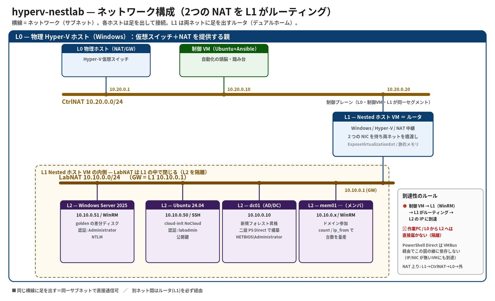

# HCCJP 第74回勉強会

## オンプレ × 冪等 × AI
### コードで建てる検証環境をOSSでみんなで作りませんか？

**2026年6月12日（金）14:00〜15:30**

ハイブリッドクラウド研究会

---

# 自己紹介

## 胡田 昌彦（えびすだ まさひこ）

- 日本ビジネスシステムズ株式会社
- Microsoft MVP for Cloud and Datacenter Management / Microsoft Azure
- HCCJP 主幹事
- 最近は **AIエージェント（Claude Code）に開発・運用のほぼすべてを任せる** 生活
- YouTube: 「えびすだまさひこ」で検索 📺

---

# 本日のアジェンダ

| 時刻 | セッション | スピーカー |
|------|-----------|-----------|
| 14:00 | オープニング | 胡田 |
| 14:05 | **Microsoft "Adaptive Cloud" Updates** | 高添 氏 |
| 14:25 | Q&A | 高添 氏 |
| 14:35 | **コードで建てる検証環境（中間報告＆デモ）** | 胡田 |
| 15:10 | **ディスカッション「こんな機能が欲しい！」** | 全員 |
| 15:25 | クロージング | 胡田 |

---

# 今日は「参加型」の回です 🙌

このスライドは **FlowAsk**（胡田の個人開発プロダクト）で動いています。

## 👉 https://flowask.ebisuda.net/e/552645

- セッション中いつでも **質問・コメント・アンケート回答** できます
- 「この構成どう思う？」「こんな機能欲しい」を聞きたい回なので
  **皆さんの声が本体** です
- YouTubeチャットでももちろんOK！

---

# Microsoft "Adaptive Cloud" 最新動向

## 高添 修 氏（日本マイクロソフト株式会社）

毎月恒例！ Azure Local・Azure Arc・Windows Server 関連の
最新情報をお届けいただきます 🎉

---

# Q&A（高添さんセッション）

ご質問は **YouTubeチャット** または **FlowAsk** からどうぞ！

## 👉 https://flowask.ebisuda.net/e/552645

---

# 今日の題材

## hyperv-nestlab（OSS・開発中）

**宣言的・冪等な Nested Hyper-V ラボ構築基盤**

### 👉 https://github.com/ebibibi/hyperv-nestlab

> 既存の Hyper-V サーバー 1 台さえあれば、`bootstrap.ps1` ひとつで
> 制御 VM（Ansible 内蔵）を自己構築し、YAML 宣言から
> Nested ホスト（L1）とその中の VM 群（L2: Windows / Linux / AD / クラスタ）を、
> どこでも同じ形で再現する

**コンセプト通りに動くところまで来ました。今日は中間報告です。**

---

<!-- _class: small -->

# デモ 🎬 — まず「建て始める」

## YAML 1枚 + 1コマンドで、今ここで建てます

```powershell
# DryRun：構築プランと必要イメージだけ確認（VMは作らない）
.\bootstrap.ps1 -L1 l1\standard-host.yml -L2 l2\ad-forest.yml -DryRun

# 本番：制御VM自己構築 → L1 → L2 → AD フォレストまで一括・冪等
.\bootstrap.ps1 -L1 l1\standard-host.yml -L2 l2\ad-forest.yml
```

**今作れる一番複雑な構成**：新規 AD フォレスト `corp.contoso.local`（dc01）＋ ドメイン参加メンバ（mem01）

- ここで叩いて **建て始めます**。完了まで十数分。
- その間に **スライドで仕組みを説明** → 最後に **建った環境を一緒に確認** します。

---

# なぜ「コードで建てる検証環境」なのか

## 検証環境づくりの「あるある」

- 検証のたびに Hyper-V マネージャーでポチポチ…手順書が育つだけ
- **同じ構成を何百回も作る（面倒！）**
- **ゴールデンイメージ作成が面倒**
- **雛形作成を頑張ったけど、バージョン更新がつらい…！**
- 「あの環境もう一回作って」→ 微妙に違うものができる
- AD・クラスタ入りの構成は特に再現がつらい
- 物理マシンが変わると全部やり直し

## やりたいこと

- **YAMLを書いて1コマンド** → 同じ環境がどこでも建つ
- 壊しても、何度でも、**同じものが** 返ってくる（冪等）
- クラウド（Azure VM）でもオンプレでも **同じコード** が動く

---

# 3つの絶対基準（設計の芯）

## 1. 前提は「Hyper-V サーバーがあること」**だけ**
制御環境・ツールはすべて自己ブートストラップ。
Packer / ADK / oscdimg などの外部依存なし（DISM 標準ツールで golden 生成）

## 2. どの環境でも**決定論的に**同じ環境になる
版固定（images.yml）+ SHA256 検証 + 単一の宣言ファイル。
**2回流して no-change** が受け入れ条件

## 3. **誰でも**使い回せる
単一エントリ `bootstrap.ps1`、ハードコードなし、データはリポジトリ配下に自己完結

---

# アーキテクチャ（3層）

```text
L0  物理 Hyper-V ホスト  ── あなたが用意する唯一の前提
│
├─ 制御 VM (Ubuntu + Ansible)        CtrlNAT 10.20.0.10  ← bootstrapが自己構築
│
└─ L1: Nested Hyper-V ホスト VM      CtrlNAT 10.20.0.20
     │   (静的メモリ / ExposeVirtualizationExtensions / MACスプーフィング)
     │   ラボストア L: ← golden / L2 VM / cloud-initシードを集約
     │
     └─ LabNAT 10.10.0.0/24  (L1内NATで自己完結 — L2はL1の中で閉じる)
          ├─ L2: Windows Server 2025  (goldenの差分ディスクから一瞬で作成)
          ├─ L2: Ubuntu 24.04         (cloud imageの差分 + cloud-initシード)
          ├─ L2: dc01 (ADフォレスト)   ← 新規フォレストに昇格
          └─ L2: mem01 …              ← ドメイン参加
```

---

<!-- _header: "" -->
<!-- _footer: "" -->
<!-- _paginate: false -->



---

<!-- _class: small -->

# 役割分担 — 誰が・どこを・どうやって

| 層・操作 | 実行主体 | 接続方式 |
|---|---|---|
| L0 操作（NAT / L1作成 / 制御VM / golden配送） | ホスト PowerShell | ローカル / PowerShell Direct |
| L1 内部（Hyper-V役割 / LabNAT / L2作成） | **Ansible** | 制御VM → WinRM → L1 |
| L2 ゲスト内 ID（静的IP / 改名 / AD昇格・参加） | ホスト PowerShell | **二段 PowerShell Direct**（L0→L1→L2） |

### ポイント
- L2 は LabNAT 内に隔離 → 制御VMから直接届かない → **L1を踏み台**にする
- PowerShell Direct は VMBus 経由 = **物理ネットワークに依存しない**
  再起動をまたぐ再接続も確実

---

<!-- _class: x-small -->

# 宣言ファイル（本物）：L1（土台）＋ L2（中身）

```yaml
# l1/standard-host.yml — 使い回す土台（L1）
l1_host:
  name: nested-lab-01
  cpu: 8
  memory_gb: 32          # 静的メモリ（動的メモリは強制OFF）
  nested: true           # ExposeVirtualizationExtensions=$true
  disk_gb: 120
  base_image: win2025-golden
  l0_switch: "Default Switch"
  network: { nat: { switch: LabNAT, subnet: 10.10.0.0/24, host_ip: 10.10.0.1 } }
  l2_defaults: { generation: 2, os: windows_server_2025 }
```

```yaml
# l2/ad-forest.yml — 中身（L2）：AD フォレスト + メンバ1台
defaults: { cpu: 2, memory_gb: 4, os: windows_server_2025, domain_join: corp.contoso.local }
domain:
  fqdn: corp.contoso.local
  netbios: CORP
  dsrm_password: "P@ssw0rd-DSRM-Lab!"      # 本番は vault で暗号化
  controllers: [ { name: dc01, ip: 10.10.0.10 } ]
groups:
  - { name: members, name_prefix: mem, count: 1, ip_from: 10.10.0.21 }
```

他: minimal-windows / minimal-linux / multi-lang / fileserver-s2d（🚧）

---

# bootstrap.ps1 — 1コマンドの中身

```powershell
# DryRunで構築プランだけ確認（VMは作らない）
.\bootstrap.ps1 -L1 l1\standard-host.yml -L2 l2\ad-forest.yml -DryRun

# 本番実行（制御VM自己構築 → L1 → L2 → AD まで一括・冪等）
.\bootstrap.ps1 -L1 l1\standard-host.yml -L2 l2\ad-forest.yml
```

1. プリフライト（Hyper-V / Python / 設定ファイル）
2. 検証 + 解決（JSON Schema + 意味検証 → resolved.json）
3. イメージ整備（Ubuntu 自動取得 / Windows golden を **DISM** で生成）
4. L0→L1 プロビジョニング → 制御 VM 構築 → golden 配送
5. L1 内 Hyper-V + LabNAT（Ansible）→ L2 作成 → AD 構築

**再実行すれば全工程が冪等に収束**（no-change が受け入れ条件）

---

# 速さと容量の工夫

## golden イメージ + 差分ディスク

- Windows: 評価版 ISO を**直リンク自動DL** → DISM で golden VHDX を生成
  （oscdimg 不要・ADK 不要・フォーム登録不要）
- Ubuntu: cloud image を版固定で取得 → VHDX 変換
- **L2 の OS ディスクは golden からの差分（ディファレンシング）ディスク**
  → 作成は一瞬、Windows L2 の初期サイズは **~300MB**

## ラボストア（L:）

- golden / L2 VM / cloud-init シードは L1 の OS ディスクではなく
  専用の大容量ディスクに集約 → L1 自体は小さく保つ

---

# 開発の進め方も「AI時代」流

- 開発はほぼ **Claude Code（AIエージェント）** に任せて進行
  - 5時間放置して自律でインフラを作らせる、という実験も（YouTubeで公開中）
- ハマりどころは Claude のメモリではなく **リポジトリ内 `KB/` に記事化**
  - 例: 「S2DはDatacenterエディション必須」「入れ子dcpromoはDNSゾーンを作り切らない」
  - AIも人間も**同じナレッジベース**を読む → 同じ罠に二度はまらない
- テスト: resolver/スキーマは pytest、実機は「2回流してno-change」

---

# 現在のステータス

| 項目 | 状態 |
|---|---|
| スキーマ / resolver / DryRun プラン | ✅ |
| L0→L1 冪等プロビジョニング | ✅ |
| イメージ整備（Windows DISM golden / Ubuntu cloud image） | ✅ |
| 制御ノード自動構築 + Ansible 本線疎通 | ✅ |
| **L2: Windows Server 2025**（実機検証） | ✅ |
| **L2: Ubuntu 24.04**（cloud-init・実機検証） | ✅ |
| **L2: AD フォレスト + ドメイン参加**（実機検証） | ✅ |
| **bootstrap.ps1 一発再現** | ✅ |
| クラスタ + S2D / Azure Local / GUI | 🚧 |

---

<!-- _class: small -->

# 建てたあと、どうやって入る？

Nested なので **層をまたいで**アクセスする。肝は **2つの経路は別物**：

- **制御（自動化）経路**
  IPネットワーク（制御VM → L1ルーティング → L2）で **SSH / WinRM**
- **コンソール（画面）経路**
  Hyper-Vマネージャーの**入れ子**（L0→L1→L2、VMBus）

**L2 は LabNAT に隔離** → 作業PC/L0 からは直接届かない。
**L1 を踏み台**にするか、**L1 内の Hyper-V マネージャー**でコンソールを開く。

> ネットワークの全体像は、さきほどの **ネットワーク構成図** を参照。

---

<!-- _class: small -->

# 4つのアクセスパターン

| やりたいこと | 方法 | 具体 |
|---|---|---|
| Linux を操作 | **① SSH** | 制御VM →`ssh labadmin@10.10.0.x`（L2 Linux） |
| Windows を操作 | **② WinRM** | 制御VM →`Enter-PSSession 10.10.0.x`（L2 Win） |
| 画面を見て GUI | **③ Hyper-Vマネージャー** | L0→L1コンソール → L1内で `vmconnect localhost "<L2>"` |
| 直接つながらない VM | **④ 踏み台 / PS Direct** | L2 は制御VM経由。壊れた VM は VMBus で L0→L1→L2 |

- **PowerShell Direct（VMBus）** は IP も WinRM も無い・壊れた VM に届く**最後の砦**
- ドメイン参加 Windows で DC への二段ホップ（クラスタ等）は **CredSSP**
- 詳細・図解は `docs/access-guide.md`（接続マトリクス＋トポロジ図）

---

# 構築完了 → 接続情報を自動表示

`bootstrap.ps1` の最後に、建った環境の**実際の値**で接続先・資格情報・接続例を一覧表示

```text
[制御 VM]   10.20.0.10:22  SSH 公開鍵  labadmin
  接続例 : ssh -i "build/ssh/id_ed25519" labadmin@10.20.0.10
[L2: web01] 10.10.0.51:5985  WinRM/NTLM  Administrator
[L2: lin01] 10.10.0.52:22    SSH         labadmin
[Hyper-Vマネージャーで L2 を操作] L0→L1コンソール → vmconnect ...
```

- L2 は **OS種別（Linux=SSH / Windows=WinRM）とドメイン参加有無で出し分け**
- 「建てたはいいけど、どこに何のIDで入るんだっけ？」を**毎回見なくて済む**
- ※平文パスワードを出すので、配信・録画時は伏せる前提

---

# デモに戻る 🎬 — 建った環境を確認

スライドの間に裏で建っていた環境を、ここで一緒に見ます。

- **L1（nested-lab-01）** の中に dc01 / mem01 が起動しているか
- **dc01**：新規フォレスト `corp.contoso.local` に昇格できているか
- **mem01**：ドメイン参加できているか
- 制御VMから **WinRM / SSH**、画面は **L1 の Hyper-Vマネージャー** で確認
- もう一度流して **no-change（冪等）** になることも確認

> 「YAML 2枚」から、AD 込みの検証環境がまるごと再現できました ✅

---

# この先の構想① — AIから自由に使える基盤に

## Skills か、MCP サーバーか

今は人間が `bootstrap.ps1` を叩く形。次の一手として:

- **案A: AIエージェント向け Skills 提供**
  Claude Code 等に「このツールの使い方」を skill として教える
  → AIが YAML を書き、bootstrap を叩き、結果を検証する
- **案B: MCP サーバー提供**
  ラボ構築をツールとして公開 → どの AI クライアントからも呼べる

### 狙い
AIに「Windows/Linux混在のAD検証環境作って」と言うだけで、
**クラウドもオンプレも、Linux も Windows も**、AIがガリガリ建てられる世界 🌍

---

# この先の構想② — その他のロードマップ

- **クラスタ + S2D**（ロール足場まで実装済み）
- **Azure Local** — 展開部分は既存 OSS をラップする形で
- **Azure 上の VM でも同じコードを** — Nested なのでホストがオンプレでも
  Azure VM でも地続き（ポータビリティ）
- **GUI** — 宣言ファイルの `language` などをドロップダウンで選ぶだけ、の入口

---

# 🗣️ ディスカッション — 皆さんに聞きたい！

1. **この構成、どう思いますか？**
   3層構造 / 制御VM+Ansible / PowerShell Direct 踏み台 / golden+差分…
2. **もっと良くするなら、どこをどうしたら良い？**
3. **AI連携は Skills と MCP サーバー、どっちが嬉しい？**
4. **「自分のこの用途で使いたい」はありますか？**
5. **こんな機能が欲しい！**

## 回答はこちらから 👇

### https://flowask.ebisuda.net/e/552645

（YouTubeチャットでもOK！どんどん書き込んでください）

---

# まとめ

- **hyperv-nestlab**: 宣言的・冪等な Nested Hyper-V ラボ構築基盤（OSS）
  - 前提は Hyper-V サーバー1台だけ。YAML + 1コマンドで L1/L2/AD まで一括構築
  - コンセプト通り動くところまで来ました（中間報告）
- これから: クラスタ/S2D → Azure Local → **AIから自由に使える基盤へ**
- **一緒に育てませんか？** Issue / PR / アイデア大歓迎です

### 👉 https://github.com/ebibibi/hyperv-nestlab
### 👉 https://flowask.ebisuda.net/e/552645

---

# クロージング

## 本日もご参加ありがとうございました！

- アーカイブは YouTube で公開します
- 感想・追加の質問はこちらへ
  **https://flowask.ebisuda.net/e/552645**
- HCCJP は **毎月第2金曜 14:00** 開催！
  次回もお楽しみに 👋
