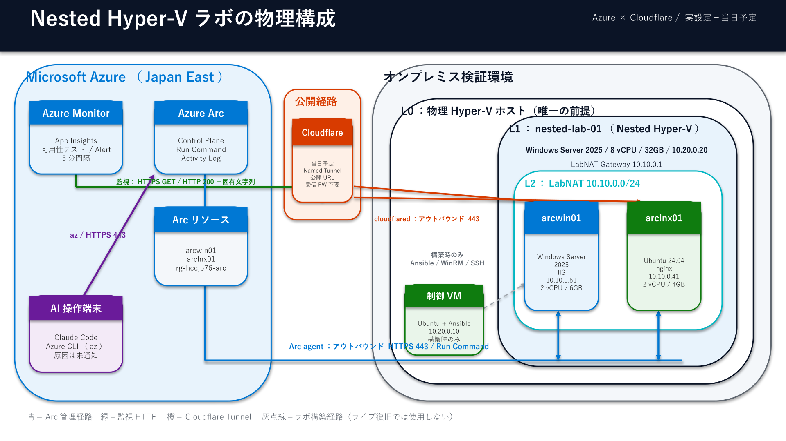
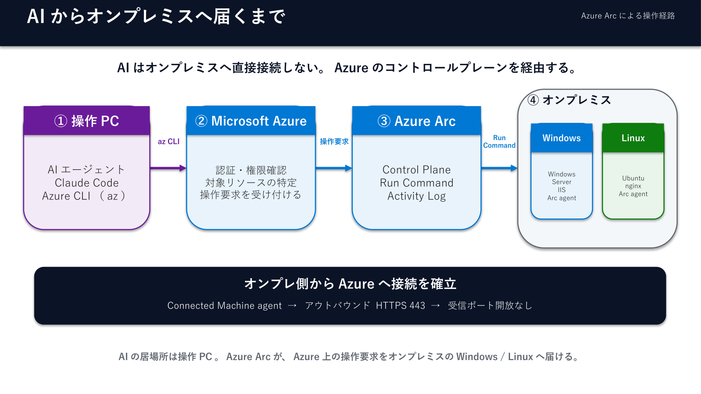
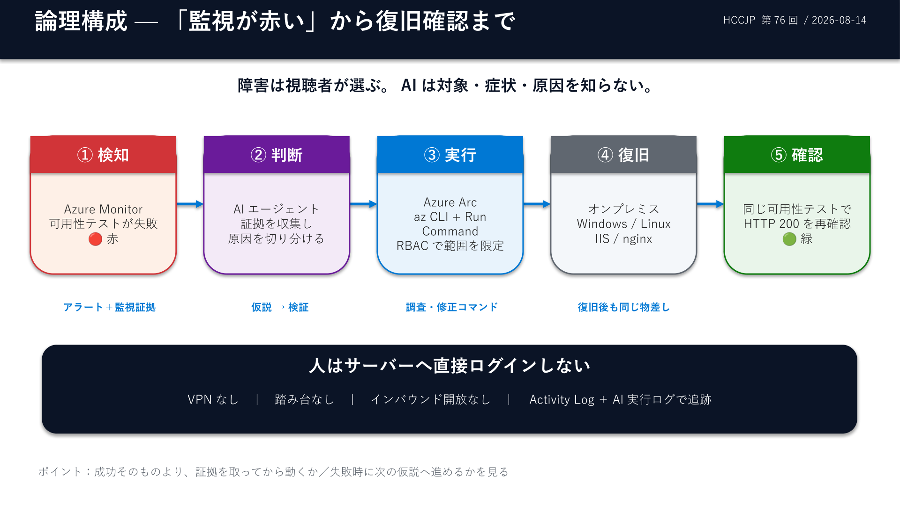

# HCCJP 第76回勉強会

## オンプレのサーバー、壊します。
## 直すのはAIです。

### Azure Arc × AIエージェントによる無人障害復旧

**2026年8月14日（金）14:00〜15:30**

ハイブリッドクラウド研究会

<!--
【14:00 / オープニング】
・配信が見えているか、音が出ているかをチャットで確認
・「今日は1本勝負のライブデモです。リハーサルはしていません」と最初に宣言
-->

---

# 自己紹介

## 胡田 昌彦（えびすだ まさひこ）

- 日本ビジネスシステムズ株式会社
- Microsoft MVP for Cloud and Datacenter Management / Microsoft Azure
- HCCJP 主幹事
- 最近は **AIエージェント（Claude Code）に開発・運用のほぼすべてを任せる** 生活
- YouTube: 「えびすだまさひこ」で検索 📺

<!-- ここは30秒。長くしない。 -->

---

# 本日のアジェンダ

| 時刻 | セッション | スピーカー |
|------|-----------|-----------|
| 14:00 | オープニング | 胡田 |
| 14:05 | **オンプレのサーバー、壊します。直すのはAIです。** | 胡田 |
| 14:50 | Q&A | 胡田 |
| 15:00 | **Microsoft "Adaptive Cloud" Updates** | 高添 氏 |
| 15:20 | Q&A | 高添 氏 |
| 15:25 | クロージング | 胡田 |

<!-- 後半に高添さんがいることを必ず言う。デモが押しても15:00で必ず切る。 -->

---

<!-- _class: small -->

# 今日のリンク（ぜんぶ開いてOKです）

| | URL |
|---|---|
| 🗳️ **投票・質問・チャット（FlowAsk）** | https://flowask.ebisuda.net/e/__EVENT_ID__ |
| 🪟 **デモサイト Windows** | __DEMO_WIN__ |
| 🐧 **デモサイト Linux** | __DEMO_LNX__ |
| 📺 YouTube Live | https://www.youtube.com/watch?v=uPc6T-wL8-0 |
| 📄 Connpass | https://hybridcloud.connpass.com/event/402528/ |
| 💾 スライド・スクリプト一式 | https://github.com/ebibibi/presentations/tree/main/HCCJP_76 |

**デモサイトを開いたまま見ていてください。壊れるのも直るのも、そちらの画面で起きます。**

<!--
【14:03】ここでFlowAskのURLをチャットにも貼る。QRを出してもいい。
デモサイトは自分で開いてもらうと「仕込みではない」ことが伝わりやすい。
-->

---

<!-- _class: small -->

# 今日やること

## 1. 目の前で、オンプレのサーバーを壊します

## 2. AIに「監視が赤い。調べて直して」とだけ伝えます

## 3. 緑に戻るまで、そのままお見せします

**壊し方は、皆さんの投票（ボタン）で決めていただきます。**
**AIには、何が起きたか一切教えません。**

<!--
【14:05】今日はこの1本だけ。欲張らない。
「成功例の再生」ではなく「公開実験」だと言い切る。
-->

---

# ルール（先に宣言しておきます）

- 🎲 **障害は投票で選んでもらう** — 私は当日まで何を壊すか決めません
- 🤐 **AIに与える情報は一言だけ** — 「監視が赤い。原因を調べて直して」
- 🚫 **私はサーバーにログインしません** — 全部 Azure Arc 越し
- 😅 **失敗したらそのまま見せます** — うまくいかない様子も含めて実態です

<!--
リハーサルをしていない理由をここで説明する:
一度解かせたシナリオを本番で再演すると、AIは答えを知っている状態になるため。
-->

---

<!-- _class: small -->

# 今日の舞台：第74回で建てたラボ

- 第74回「コードで建てる検証環境」の **Nested Hyper-V ラボ**（コードで再構築できる）
- L2 の 2台を Azure Arc に接続済み・どちらも **動いている Web サイト**を持っている

| VM | OS / Web | IP | デモサイト | ポータル |
|---|---|---|---|---|
| arcwin01 | Windows Server 2025 / IIS | 10.10.0.51 | [開く](__DEMO_WIN__) | [arcwin01](https://portal.azure.com/#@7b54e7bc-acb0-4a9b-ad82-7421b9e4e2d9/resource/subscriptions/b0f2ddcb-c22b-4728-89b3-26e90a494ae4/resourceGroups/rg-hccjp76-arc/providers/Microsoft.HybridCompute/machines/arcwin01/overview) |
| arclnx01 | Ubuntu 24.04 / nginx | 10.10.0.41 | [開く](__DEMO_LNX__) | [arclnx01](https://portal.azure.com/#@7b54e7bc-acb0-4a9b-ad82-7421b9e4e2d9/resource/subscriptions/b0f2ddcb-c22b-4728-89b3-26e90a494ae4/resourceGroups/rg-hccjp76-arc/providers/Microsoft.HybridCompute/machines/arclnx01/overview) |

**デモサイトは今すぐ開けます。壊れる瞬間も、戻る瞬間も、ご自分の画面でどうぞ。**

<span class="cue">【画面】ポータルの Machines 一覧 → 2台とも Connected を見せる</span>

<!-- ここで一度ポータルに切り替える。緑の可用性画面も先に見せておくと、赤くなったときの対比が効く。 -->

---

<!--
_header: ""
_footer: ""
_paginate: false
-->



<!--
物理構成。話す順番:
1. 左＝Azure、右＝オンプレ。境界をまたぐ線は3本しかない
2. 青＝Arc管理経路（オンプレ発・アウトバウンド443）
3. 緑＝Azure Monitorからの監視HTTP
4. 橙＝Cloudflare Tunnel（オンプレ発・アウトバウンド443）
5. 受信ポート開放・VPN・踏み台はどこにも無い
6. 灰点線＝ラボ構築時だけ使うAnsible経路。ライブ復旧では使わない
-->

---

<!--
_header: ""
_footer: ""
_paginate: false
-->



<!--
AIの居場所の話。ここが今日いちばん誤解されやすい。
「AIがオンプレに直接入っている」のではない。
AIがいるのは操作PC。az CLI → Azure → Arc Run Command → オンプレ、の一本道。
だから権限の話（後半）は、全部 Azure 側の RBAC で切れる。
-->

---

<!-- _class: small -->

# なぜ Azure Arc なのか

## オンプレは無くならない

レイテンシ・規制・既存資産・コスト。**無くならない前提で考える**。

## 無くせるのは「そこまで行く手間」のほう

> 障害連絡 → VPN 接続 → 踏み台にログイン → RDP → ようやく調査開始

- 深夜・外出先・移動中……**この経路そのものがボトルネック**
- Arc は「サーバーを Azure に移す」話ではなく、**運用の入口を Azure に寄せる**話

<!-- ここは3分。共感パートなので早口にならないよう注意。 -->

---

<!-- _class: small -->

# 繋ぐ仕組み（3分でおさらい）

```bash
# エージェントを入れて、Azureに繋ぐ。これだけ
azcmagent connect --resource-group rg-hccjp76-arc \
  --tenant-id <tenant> --subscription-id <sub> --location japaneast
```

- **通信はアウトバウンド 443 のみ**／インバウンド開放は一切不要
- Arc Gateway でエンドポイントを集約できる
- 繋がると、オンプレのサーバーが **Azureリソースとして見える**

<span class="cue">【画面】ポータルで arcwin01 のリソースブレードを開く</span>

---

<!-- _class: small -->

# Arc越しに使う手段（今日使うのはここ）

| やりたいこと | 手段 |
|---|---|
| **任意コマンドを流す** | **Run Command** ← 今日の主役 |
| 対話的に入る | SSH over Arc |
| 構成を宣言して強制する | Machine Configuration |
| Webの死活を監視する | Azure Monitor / Application Insights |
| OSのログ・メトリクスを見る | Azure Monitor Agent (AMA) |
| パッチを当てる | Azure Update Manager |

**入口が全部 `az` に統一されている＝AIエージェントがそのまま手を持てる**

---

<!-- _class: small -->

# AIの手をどう作るか

- <strong>MCPではなく「CLI＋スキル」</strong>で組んでいる（うちの流儀）
  - `az` は枯れている・認証も権限もAzure側で完結する・ログが Activity Log に残る
- AIに教えるのは **「正しい叩き方」** — 手順をスキルとして文書化しておく
- **渡す権限は絞る** — 触れるサブスクリプション／リソースグループを限定する
- 実際、この環境の準備（Webページ配布まで）も **すべて Run Command 経由**でやった
  - SSHもRDPも使っていない。準備と本番で経路が同じ

<!-- 「AIに何を渡すか」＝後半の権限の話への伏線。ここでは深入りしない。 -->

---

<!-- _class: small -->

# 監視は「専用ダッシュボード」を作らない

- Application Insights の **Standard 可用性テスト**（5分間隔）
- HTTP 200 **＋ ページ固有の文字列**を検証（プロキシのエラーページを成功と誤認しないため）
- オンプレ側にパブリックIPもインバウンド開放も持たせない → **Cloudflare Tunnel** で公開
- ⚠️ Arc の Connected Machine heartbeat は**Web障害の信号にならない**
  （`Disconnected` 判定まで通常15〜30分）

<span class="cue">【画面】[Azure Monitor の「可用性」画面](__AVAILABILITY__)（今は 100% / 緑）</span>

---

<!-- _class: small -->

# 事前検証：どれくらいで赤くなるか（8/5 実測）

| イベント | Linux / nginx | Windows / IIS |
|---|---:|---:|
| サービス停止（Run Command） | 17:51:03 | 17:51:46 |
| 可用性サンプルが 0% | 17:55 | 17:55 |
| Azure Monitor アラート発火 | 17:57:15 | 17:57:13 |
| **停止 → 発火** | **6分12秒** | **5分27秒** |
| 復旧（Run Command）→ 100% | 18:00 | 18:00 |

<strong>赤くなるまで数分かかります。</strong>その間は雑談タイムです 🍵

<!-- 「無音の数分」を事故にしないための予告。ここ大事。 -->

---

<!-- _class: lead -->

# それでは、壊します 🔨

## この下のボタンで投票してください

### 次のスライドに選択肢が出ます

<!--
【14:20 目安】
・FlowAskの選択式質問（ボタン）で投票。集計はリアルタイムで出る
・投票は2分で締める。同数なら私が選ぶ、と先に宣言しておく
・シナリオと対象OSは別々の質問。2回押してもらう
-->

---

<!-- _class: small -->

# 障害シナリオ（当日提示する選択肢）

| # | 何を壊すか | OS |
|---|---|---|
| 1 | Webサービスを止める | Linux / Windows |
| 2 | 設定ファイルを壊して起動不能にする | Linux |
| 3 | ファイアウォールで塞ぐ（**サービスは正常なのに繋がらない**） | Windows |
| 4 | ログ肥大でディスクを満杯にする | Linux |
| 5 | サービスアカウントのパスワードを変える | Windows |

**#3 と #5 は「症状と原因が一致しない」タイプ。AIが"考えている"のが一番よく見えます。**

<span class="cue">→ この直後にボタンが出ます。番号と、対象OS（Windows / Linux）を選んでください</span>

<!-- リハーサル無し＝AIにとっても初見であることを、投票前にもう一度言う。 -->

---

<!-- _class: small -->

# 壊し方以外も、募集しています 🙋

- 選択肢の5つ以外に **「これを試してほしい」** があれば、遠慮なくどうぞ
  - 例: 「先に切り分け方針を言わせてみて」「わざと嘘の情報を与えたらどうなる？」
  - 例: 「復旧後にもう一度同じ障害を出したら、2回目は速い？」
- **AIへの指示そのもの**を書いてもらってもOKです（そのまま打ち込みます）
- 書く場所はどちらでも
  - <strong>FlowAskの「AIに試してほしいこと」</strong>（自由記述・匿名OK）
  - **YouTubeのチャット**

**時間の許すかぎり、その場で拾って実行します。**

<!--
【投票の直後 & 赤くなるのを待つ数分】ここを読み上げて時間を埋める。
拾った要望は種明かしパートでも触れると、参加してもらえた感が出る。
-->

---

<!--
_header: ""
_footer: ""
_paginate: false
-->



<!--
壊す直前に、この1枚で「これから何が起きるか」を予告しておく。
① 検知（Azure Monitor が赤） → ② 判断（AIが証拠を集める） → ③ 実行（Arc Run Command）
→ ④ 復旧（オンプレ） → ⑤ 確認（同じ可用性テストが緑）
見てほしいのは成功そのものではなく、②の「証拠を取ってから動くか」。
-->

---

<!-- _class: lead -->

# 🔴 監視が赤くなりました

## AIに渡す言葉は、これだけ

### 「監視が赤い。原因を調べて直して」

<span class="cue">【画面】ここからAIのターミナルを大きく映す。以降しばらくスライドに戻らない</span>

---

<!-- _class: small -->

# ライブ中に注目してほしいところ 👀

- AIが **どこから調べ始めるか**（対象の特定 → 症状の確認 → 原因の切り分け）
- **推測で直そうとしないか**（証拠を取ってから動いているか）
- 一度で直らなかったとき、**次に何を試すか**
- そして —— **私は一度もサーバーにログインしていない**

<!--
【14:25〜14:40 / ライブ15分】
・実況は最小限。AIの出力を読ませる時間を作る
・沈黙が続いたら「今こういう仮説を検証しています」と1行だけ補う
・14:40 で復旧していなければ、そこで一度止めて種明かしへ進む（時間厳守）
-->

---

<!-- _class: lead -->

# 🟢 復旧しました（といいですね）

<span class="cue">【画面】可用性テストが 100% に戻るところを見せる</span>

---

<!-- _class: small -->

# 種明かし：AIは何を叩いたのか

- 実行された `az` / Run Command を **全部**並べて振り返る
- 流れを色分けして見る：**調査 → 仮説 → 検証 → 修正 → 再確認**
- 直らなかった試行も消さずに見せる（そこが一番情報量が多い）
- 同じものが **Azure Activity Log** にも残っている
  → 「誰が」「いつ」「どのリソースに」「何をしたか」が Azure 側の記録として残る

<span class="cue">【画面】Activity Log を開いて Run Command の記録を見せる</span>

<!-- 【14:40〜14:47】ブラックボックスにしないことが信頼の条件、という言い方をする。 -->

---

# ……で、怖くないですか？ 😨

- Run Command は **任意のコマンドを実行できる** ＝ 最強かつ最恐
- AIが暴走したら？ 誤った対象に流したら？
- でも —— **人間がやっても同じリスクはある**
- 違うのは、**記録が残るかどうか**と、**範囲を先に決められるかどうか**

<!-- 【14:47】ここが本題。デモは前振り、という顔をして話す。 -->

---

<!-- _class: small -->

# 「できる」と「やらせていい」の線引き

| 論点 | 現実的な落とし所 |
|---|---|
| 権限 | スコープを切る／カスタムロール／まず読み取り専用の世界を作る |
| 対象 | タグやリソースグループで、AIが触れる範囲を物理的に限定 |
| 実行 | 破壊的操作は **承認ゲート**を挟む（最後は人が押す） |
| 記録 | Activity Log ＋ AIの実行ログ。**人間の手作業より追跡しやすい** |
| 練習 | まず検証環境で流す（今日のラボがまさにそれ） |

**「AIに全部やらせる／やらせない」の二択にしないこと。**

---

<!-- _class: small -->

# まとめ

- **運用する場所**が、物理的な「そこ」から外れた（Azure Arc）
- そこにAIが入ると、**手を動かす人**が要らなくなる場面が出てくる
- では、インフラエンジニアは何をする人になるのか
  - 環境を**設計する**人
  - AIに渡す**権限と境界を決める**人
  - 起きたことを**説明できる**人
- 今日の実験がうまくいっても、いかなくても、**線引きの議論は先に始められます**

---

<!-- _class: lead -->

# Q&A

## チャット・コメントからどうぞ 🙋

<!-- 【14:50〜15:00】15:00 に必ず高添さんへバトンタッチ。時間が余ったら第74回のラボの話をする。 -->

---

# 次のセッション

## Microsoft "Adaptive Cloud" Updates

### 高添 修 氏（日本マイクロソフト株式会社）

Azure Local / Azure Arc / Windows Server の最新動向

<!-- 【15:00】画面共有を切り替える。切り替え後に音声が出ているか必ず確認。 -->

---

# ご参加ありがとうございました！

- HCCJP は **Azure × ハイブリッドクラウド × 生成AI** のコミュニティです
- 企業・個人問わずオープンに参加できます
- **登壇者・事例共有 募集中！** 「うちのこの話、してみたい」をぜひ 🙌
- Connpass: https://hybridcloud.connpass.com/

## 次回：第77回（2026年9月11日（金）14:00〜）

<!-- 【15:25】アンケート・Connpassのフィードバック・次回告知。YouTubeのアーカイブが残ることも伝える。 -->
